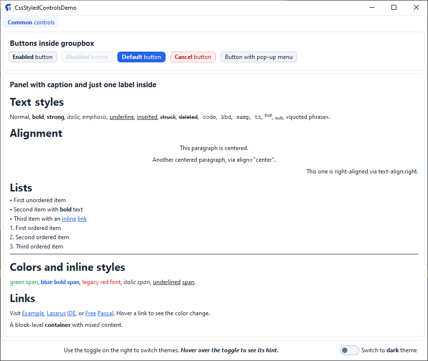
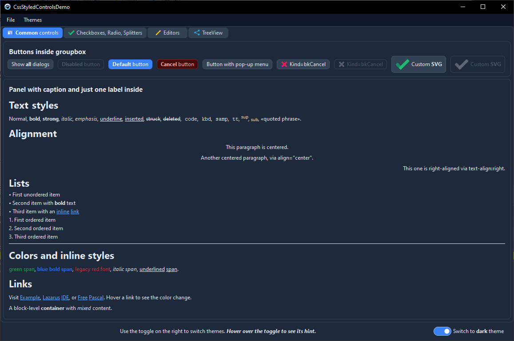

# CssStyledControls
[](LICENSE)

A set of visual controls for **Lazarus / Free Pascal (LCL)** that are fully stylable with **CSS** and support **HTML formatting** for their text content.

The library brings a modern, web-like approach to desktop GUI development: instead of tweaking dozens of properties by hand, you describe the look of every control in a single CSS file — complete with selectors, pseudo-classes, cascading, specificity, CSS variants (themes), gradients, box shadows, and inline styles. A built-in `TCssProxy` component can even push the same theme onto **standard LCL controls** (`TForm`, `TButton`, `TEdit`, `TLabel`, `TPanel`).

> [!WARNING]
> **Work in progress.** The library is under active development.
> Some controls may not yet be fully functional, and parts of this documentation
> may be incomplete or out of date. APIs and behavior can change without notice.

---

## Table of Contents

- [Features](#features)
- [Screenshots](#screenshots)
- [Installation](#installation)
- [Quick Start](#quick-start)
- [Demo Project](#demo-project)
- [Included Controls](#included-controls)
- [CSS Overview](#css-overview)
- [General CSS Properties](#general-css-properties)
- [Per-Control CSS Properties](#per-control-css-properties)
- [Themes (Light and Dark)](#themes-light-and-dark)
- [HTML Formatting](#html-formatting)
- [Link Handling](#link-handling)
- [Tooltips with CSS and HTML](#tooltips-with-css-and-html)
- [Style Provider API](#style-provider-api)
- [Proxy Styling for Standard LCL Controls](#proxy-styling-for-standard-lcl-controls)
- [Design-Time Support](#design-time-support)
- [Example Theme](#example-theme)
- [License](#license)

---

## Features

- **Full CSS styling** — every control reads its appearance from CSS rules: background, gradients, borders, per-corner radii, padding, fonts, colors, alignment, opacity, text shadows, box shadows, cursors, and more.
- **CSS selectors** — match by class name, `CssTag`, `CssID`, `CssClass`, pseudo-classes and combinators.
- **Pseudo-classes** — `:hover`, `:active`, `:focus`, `:focus-visible`, `:enabled`, `:disabled`, `:checked`, `:unchecked`, `:default`, `:cancel`.
- **Cascading and specificity** — later rules and more specific rules win, exactly like in the browser.
- **Themes / variants** — a single CSS file can contain several `@variant <name> { ... }` blocks (e.g. `light` and `dark`), switchable at runtime through `TCssStyleProvider`.
- **Gradients** — `linear-gradient(...)` and `radial-gradient(...)` with angles (`deg`, `grad`, `rad`, `turn`, `to …`) and color stops.
- **Box shadows** — `box-shadow: <dx> <dy> <blur> <spread> <color>` on any control.
- **Per-corner radii** — `border-radius` accepts 1–4 values (`TL TR BR BL`).
- **HTML text rendering** — `HtmlMode` renders captions, list items, menu items, tree cells, and hints as HTML with inline styles, lists, headings, code blocks, links, etc.
- **Clickable links** — `<a href="...">` inside HTML content raises `OnLinkClick`, changes the cursor, and supports `a`, `a:hover`, `a:active` CSS rules.
- **CSS-styled tooltips** — tooltips can be styled with the `::hint` selector and rendered as HTML.
- **Windows 11-style switches** — set `checkbox-style: toggle` / `radio-style: toggle` on a checkbox / radio button (or on a `toggle` class) to render them as pill switches with an animated thumb.
- **Nested child styling** — composite controls (`TCssComboBox`, `TCssCheckGroup`, `TCssRadioGroup`, `TCssListBox`, `TCssVirtualStringTree`, tabs) expose `*CssClass` / `*CssStyle` properties so you can style their internal children too.
- **Focus-within** — a parent (`TCssPanel`, `TCssGroupBox`, `TCssCheckGroup`, `TCssRadioGroup`, `TCssComboBox`, `TCssTabControl`, `TCssPageControl`) can highlight its border while a child has focus (`focus-within: true`).
- **Standard LCL styling** — `TCssProxy` reads the active CSS variant and applies `background`, `color`, `font-*`, and `text-align` to plain LCL `TButton`, `TEdit`, `TLabel`, `TPanel`, and forms.
- **Anti-aliased rendering** — rounded boxes, circles, triangles, check marks, and focus rings are drawn with sub-pixel coverage and cached bitmaps.
- **No external dependencies** — pure LCL, works on Windows, Linux, and macOS.

---

## Screenshots

Light and dark variants of the same form, switched at runtime by a single toggle:

| Light | Dark |
| :---: | :---: |
|  |  |

Both screenshots come from the included demo project (see [Demo Project](#demo-project)): the same controls, the same form, the same CSS — only the active `@variant` changes.
---

## Installation

1. Clone the repository:

   ```bash
   git clone https://github.com/avavdoshin/CssStyledControls.git
   ```

2. Open the runtime package `Packages/CssStyledControls.lpk` in Lazarus (`Package → Open Package File…`).

3. Click **Compile**, then **Use → Install**.

4. Open the design-time package `Packages/CssStyledControlsDesign.lpk` and install it too. It adds:

   - a **multi-line CSS editor** for `TCssStyleProvider.CssText`,
   - a **file picker** for `TCssStyleProvider.FileName`,
   - a **component editor** with an `Edit CSS…` verb on `TCssStyleProvider`,
   - a **page editor** (`New Page`, `Delete Page`, `Next Page`, `Previous Page`) on `TCssPageControl`,
   - a **visual menu designer** for `TCssMainMenu` / `TCssPopupMenu`,
   - a **Columns Editor** for `TCssVirtualStringTree.Columns`,
   - a **shortcut picker** (with ~150 common shortcuts) for `TCssMenuItem.Shortcut`.

5. The component palette gets a new tab `CSSStyledControls`:

   `TCssStyleProvider`, `TCssProxy`, `TCssButton`, `TCssCheckBox`, `TCssCheckGroup`, `TCssComboBox`, `TCssEdit`, `TCssGroupBox`, `TCssLabel`, `TCssListBox`, `TCssMemo`, `TCssMainMenu`, `TCssPopupMenu`, `TCssPanel`, `TCssRadioButton`, `TCssRadioGroup`, `TCssScrollBar`, `TCssSplitter`, `TCssVirtualStringTree`, `TCssPageControl`, `TCssTabControl`, `TCssTabSheet`.

   `TCssMenuItem` is not shown on the palette: it is created and edited only through the visual menu designer.

---

## Quick Start

1. Drop a `TCssStyleProvider` onto a form (or a data module).
2. Fill its `CssText` property (or set `FileName` to a `.css` file), for example:

   ```css
   TCssButton {
     background-color: #2563EB;
     color: #FFFFFF;
     border: 1px solid #2563EB;
     border-radius: 6px;
     padding: 6px 14px;
     text-align: center;
     vertical-align: middle;
   }
   TCssButton:hover    { background-color: #1D4ED8; }
   TCssButton:active   { background-color: #1E40AF; }
   TCssButton:disabled {
     background-color: #F1F5F9;
     color: #94A3B8;
     border-color: #E2E8F0;
   }
   ```

3. Drop a `TCssButton` (or any other `TCss*` control) onto the same form and assign its `StyleProvider` property to the provider created in step 1. Every control that references the provider is automatically restyled whenever the CSS text changes.

4. (Optional) Set `HtmlMode := True` on a control and use HTML in its `Caption`:

   ```html
   <b>Save</b> <span style="color:#f00">now</span>
   ```

5. (Optional) For a light/dark theme, wrap your rules in `@variant` blocks:

   ```css
   @variant light
   {
     TCssButton { background-color: #F1F5F9; color: #1E293B; }
   }

   @variant dark
   {
     TCssButton { background-color: #334155; color: #E2E8F0; }
   }
   ```

   and toggle it in code:

   ```pascal
   CssStyleProvider1.DefaultStyleName := 'dark';
   ```

---

## Demo Project

A ready-to-run demonstration lives in the `Demo` folder:

```
Demo/CssStyledControlsDemo.lpr
Demo/Unit1.pas
Demo/Unit1.lfm
```

Open `CssStyledControlsDemo.lpi` in Lazarus and press **F9**.

What the demo shows:

- A single form with a `TCssPageControl` (`Common controls` tab).
- A `TCssGroupBox` containing several `TCssButton`s (enabled, disabled, default, cancel, and one with a `TCssPopupMenu`).
- A `TCssPanel` with a `TCssLabel` whose `Caption` is HTML demonstrating every supported tag: headings, bold / italic / underline / strike / code / kbd / samp / tt / sup / sub / `<q>`, alignment via both `align="…"` and `style="text-align:…"`, ordered and unordered lists, inline colors, legacy `<font color>`, spans, and clickable `<a>` links.
- A `TCssCheckBox` styled as a Windows 11 switch (`.toggle` class) that switches the whole application between the **light** and **dark** variants by setting `CssStyleProvider1.DefaultStyleName`.
- A `TCssProxy` that applies the same theme to the plain `TForm`.

The relevant demo handlers are tiny:

```pascal
procedure TForm1.CssCheckBox1Click(Sender : TObject);
begin
  if CssCheckBox1.Checked then
    CssStyleProvider1.DefaultStyleName := 'Dark'
  else
    CssStyleProvider1.DefaultStyleName := 'Light';
end;

procedure TForm1.CssLabel2LinkClick(Sender : TObject; const AHref, AText : UnicodeString);
begin
  MessageDlg('Link clicked', 'Href='+AHref+' , Text='+AText, mtInformation, [mbOk], '');
end;
```

---

## Included Controls

| Control                   | Description                                                                  |
| ------------------------- | ---------------------------------------------------------------------------- |
| `TCssStyledControl`       | Base class of all CSS-styled controls. Contains the CSS engine, the HTML parser, and the AA renderer. |
| `TCssStyleProvider`       | Non-visual component that holds CSS text and pushes it to controls.          |
| `TCssProxy`               | Non-visual component that applies the active CSS variant to plain LCL controls (`TForm`, `TButton`, `TEdit`, `TLabel`, `TPanel`). |
| `TCssButton`              | Push button with `Default`, `Cancel`, `ModalResult`, and `:default` / `:cancel` pseudo-classes. |
| `TCssCheckBox`            | Tri-state check box with an optional Windows 11-style **switch** appearance. |
| `TCssCheckGroup`          | Group of check boxes laid out in columns, with per-item state.               |
| `TCssRadioButton`         | Radio button with an optional Windows 11-style **switch** appearance.        |
| `TCssRadioGroup`          | Group of radio buttons laid out in columns.                                  |
| `TCssComboBox`            | Dropdown combo box (`ccsDropDown`, `ccsDropDownList`).                       |
| `TCssEdit`                | Single-line editor with selection, clipboard, undo, placeholder styles.      |
| `TCssMemo`                | Multi-line editor with word-wrap, scrollbars, selection, clipboard, colored caret and placeholder. |
| `TCssLabel`               | Label with `FocusControl`, `ShowAccelChar`, `Transparent`.                   |
| `TCssListBox`             | List box with multi-select, hover, per-item colors, custom scrollbar.        |
| `TCssPanel`               | Container panel with `focus-within` support.                                 |
| `TCssGroupBox`            | Group box with caption on the border and `focus-within` support.             |
| `TCssScrollBar`           | Custom scrollbar (can be drawn standalone or inside another control).        |
| `TCssSplitter`            | Splitter with grip, live/ghost preview, and adjacent-control highlighting.   |
| `TCssMainMenu`            | Menu bar with dropdowns.                                                     |
| `TCssPopupMenu`           | Popup menu component (non-visual) with `Popup` / `AutoPopup`.                |
| `TCssMenuItem`            | Single menu item. Hidden from the palette; edited by the visual menu designer. |
| `TCssTabControl`          | Tab strip without pages, with optional overflow scroll buttons.              |
| `TCssPageControl`         | Tab control with pages (`TCssTabSheet`).                                     |
| `TCssTabSheet`            | A single page of a `TCssPageControl`.                                        |
| `TCssVirtualStringTree`   | Virtual tree view with columns, checkboxes, editing, sorting, drag & drop, per-cell alignment, lazy loading, and incremental search. |
---

## CSS Overview

### Where the CSS Lives

There are three ways to give a control its CSS rules, applied in this order (later sources override earlier ones):

1. `TCssStyleProvider` — the recommended way for an application-wide theme. Assign the provider to a control's `StyleProvider` property.
2. `StyleName` — selects a specific variant inside the provider. If empty, the provider's `DefaultStyleName` is used.
3. `CssStyle` — inline declarations applied after everything else. Equivalent to the HTML `style="..."` attribute.

Additionally, `CssTag`, `CssID`, and `CssClass` define how the control is matched by selectors.

### Selectors

A selector is a chain of simple selectors. The engine parses the **last** simple selector in the chain (descendant/child combinators are accepted but only the rightmost part is matched, like in simplified CSS).

Supported simple selector components:

| Syntax                     | Matches                                                                  |
| -------------------------- | ------------------------------------------------------------------------ |
| `*`                        | Any control.                                                             |
| `Name`                     | The control's class name (`TCssButton`), `CssTag`, `'control'`, or `'TCssStyledControl'`. |
| `#id`                      | `CssID`.                                                                 |
| `.class`                   | One of the classes in `CssClass` (space-separated list, several allowed). |
| `:pseudo`                  | A pseudo-class (see below).                                              |
| `a`, `a:hover`, `a:active` | Rules for HTML links inside `HtmlMode` text.                             |
| `::hint`                   | Rules for the control's tooltip.                                         |

Example:

```css
TCssButton                 { /* by class name */ }
button.primary             { /* by tag + class  */ }
#saveButton                { /* by id           */ }
TCssButton:hover           { /* pseudo-class    */ }
a                          { /* html link       */ }
a:hover                    { /* hovered link    */ }
::hint                     { /* tooltip         */ }
.toggle                    { /* class selector  */ }
```

### Pseudo-Classes

| Pseudo-class       | Active when…                                            |
| ------------------ | ------------------------------------------------------- |
| `:hover`           | The mouse is over the control.                          |
| `:active`          | The left mouse button is pressed on the control.        |
| `:focus`           | The control has focus.                                  |
| `:focus-visible`   | Same as `:focus`.                                       |
| `:enabled`         | `Enabled = True`.                                       |
| `:disabled`        | `Enabled = False`.                                      |
| `:checked`         | `Checked = True`.                                       |
| `:unchecked`       | `Checked = False`.                                      |
| `:default`         | (`TCssButton` only) `Default = True`.                   |
| `:cancel`          | (`TCssButton` only) `Cancel = True`.                    |

### Specificity and Cascade

Rules are sorted by a simplified specificity tuple, then by source order:

1. **A** — number of `#id` parts (`0` or `1`).
2. **B** — number of `.class` and `:pseudo` parts.
3. **C** — `1` if a type/tag name was present, else `0`.

If everything is equal, rules that appear later in the CSS text win. Inline styles (`CssStyle`) are applied last of all.

### Themes (Variants)

A single CSS text may contain several named variants. Each variant starts with a marker:

```css
@variant light
{
  TCssButton { background-color: #2563EB; color: #FFFFFF; }
}

@variant dark
{
  TCssButton { background-color: #3B82F6; color: #FFFFFF; }
}
```

The alternative bracket syntax is also accepted:

```css
[light]
TCssButton { /* ... */ }

[dark]
TCssButton { /* ... */ }
```

Everything between one `@variant` marker and the next belongs to that variant. Rules placed **before** the first marker belong to `DefaultStyleName`.

At runtime, choose the theme by setting the provider's `DefaultStyleName` or a control's `StyleName`:

```pascal
CssStyleProvider1.DefaultStyleName := 'dark';
// or per control:
CssButton1.StyleName := 'dark';
```

A file without any `@variant` marker is treated as a single variant named by `DefaultStyleName` (`'default'` by default).

---

## General CSS Properties

These declarations are understood by **every** `TCssStyledControl` descendant.

### Background

| Property              | Example                                | Notes                                                       |
| --------------------- | -------------------------------------- | ----------------------------------------------------------- |
| `background`          | `background: #fff;`                    | Shorthand; picks the first color token, or a gradient if the value is `*-gradient(...)`. |
| `background-color`    | `background-color: transparent;`       | `transparent` means "do not fill".                          |
| `background-image`    | `background-image: linear-gradient(…)` | Supports `linear-gradient(...)` and `radial-gradient(...)`. |

### Gradients

```css
TCssPanel {
  background-image: linear-gradient(180deg, #2563EB 0%, #1E40AF 100%);
}

TCssPanel.radial {
  background-image: radial-gradient(#FFFFFF 0%, #CBD5E1 100%);
}
```

Supported angle units: `deg`, `grad`, `rad`, `turn`, and the `to <side>` / `to <corner>` keywords. Color stops accept `%` positions; missing positions are interpolated automatically.

### Text

| Property          | Values                                        | Notes                                                  |
| ----------------- | --------------------------------------------- | ------------------------------------------------------ |
| `color`           | CSS color                                     | Text color.                                            |
| `text-align`      | `left` \| `center` \| `right`                 | Horizontal alignment of caption/text.                  |
| `vertical-align`  | `top` \| `middle` / `center` \| `bottom`      | Vertical alignment.                                    |
| `text-shadow`     | `1px 1px #000` / `none`                       | `<dx> <dy> [color]`.                                   |
| `font`            | `italic bold 12pt 'Segoe UI'`                 | Shorthand; the first recognized size wins.             |
| `font-family`     | `'Segoe UI', Arial, sans-serif`               | First family found on the system wins; keyword families are resolved. |
| `font-size`       | `12pt` \| `14px` \| `medium` \| `large` …     | `pt` is converted to px.                               |
| `font-weight`     | `normal` \| `bold` \| `100`…`900`             | 600 and above ⇒ bold.                                  |
| `font-style`      | `normal` \| `italic` \| `oblique`             |                                                        |

Generic families `serif`, `sans-serif`, `monospace`, `cursive`, `fantasy`, and `system-ui` are mapped to real fonts on the current system.

### Border

| Property          | Example                                    | Notes                                                  |
| ----------------- | ------------------------------------------ | ------------------------------------------------------ |
| `border`          | `1px solid #ccc`                           | Shorthand for width / style / color.                   |
| `border-width`    | `1px`, `2px`, `thin`, `medium`, `thick`    |                                                        |
| `border-color`    | `#cccccc`                                  |                                                        |
| `border-style`    | `none` \| `solid` \| `dotted` \| `dashed`  |                                                        |
| `border-radius`   | `6px` \| `6px 4px` \| `6px 4px 2px` \| `6px 4px 2px 0` | 1–4 values, CSS shorthand (`TL TR BR BL`). |

### Spacing

| Property                                                          | Notes                            |
| ----------------------------------------------------------------- | -------------------------------- |
| `padding`                                                         | 1–4 values, CSS shorthand.       |
| `padding-top`, `padding-right`, `padding-bottom`, `padding-left`  | Individual sides.                |

### Interaction and Effects

| Property       | Values                                | Notes                                                |
| -------------- | ------------------------------------- | ---------------------------------------------------- |
| `cursor`       | `pointer`, `text`, `wait`, `move`, `not-allowed`, `no-drop`, `help`, `crosshair`, `progress`, `e-resize`, `w-resize`, `n-resize`, `s-resize`, `ne-resize`, `sw-resize`, `nw-resize`, `se-resize`, `col-resize`, `row-resize`, `default`, … | Maps to LCL cursor constants. |
| `opacity`      | `0.0` … `1.0` (or `50%`)              | Blends the control's colors with its parent color.   |
| `focus-color`  | CSS color                             | Color of the focus rectangle.                        |
| `focus-within` | `true` \| `false`                     | (Composite controls) highlight the parent while a child has focus. |
| `box-shadow`   | `2px 2px 4px 1px rgba(0,0,0,.25)`     | `<dx> <dy> [blur] [spread] [color]`. Supports `inset` (parsed and ignored). |

### Colors

The following formats are accepted anywhere a color is expected:

- `#RGB`, `#RGBA`, `#RRGGBB`, `#RRGGBBAA`
- `rgb(r, g, b)`, `rgba(r, g, b, a)` with values `0..255` or `0..100%`
- Named colors: `black`, `white`, `red`, `green`, `blue`, `yellow`, `orange`, `purple`, `gray` / `grey`, `silver`, `maroon`, `olive`, `lime`, `aqua` / `cyan`, `teal`, `navy`, `fuchsia` / `magenta`, `pink`, `brown`, `gold`, `khaki`, `beige`, `ivory`, `snow`, `tomato`, `coral`, `salmon`, `darkgray`, `lightgray`, `dimgray`, `whitesmoke`
- `transparent`

### Lengths

Lengths accept `px`, `pt` (converted to px at 96 DPI), unit-less numbers (treated as px), and the keywords `thin` (1), `medium` (2), `thick` (4).
---

## Per-Control CSS Properties

Each control adds its own set of declarations on top of the general ones. All of them are reset by `ResetStyle` and can be overridden via `:hover`, `:active`, `:focus`, `:disabled`, `:checked`, etc.

### TCssButton

No extra properties. Use the standard pseudo-classes plus `:default` and `:cancel`.

Additional Pascal properties: `Default`, `Cancel`, `ModalResult`.

```css
TCssButton:default { background-color: #2563EB; color: #FFFFFF; }
TCssButton:cancel  { background-color: #FEF2F2; color: #B91C1C; }
```

### TCssCheckBox

| Property                  | Notes                                              |
| ------------------------- | -------------------------------------------------- |
| `checkbox-background`     | Fill color of the box.                             |
| `checkbox-border-color`   | Border color of the box.                           |
| `checkbox-border-width`   | Border width of the box.                           |
| `checkbox-radius`         | Corner radius of the box.                          |
| `check-color`             | Color of the check mark.                           |
| `checkbox-style`          | `toggle` / `switch` turns the box into a pill switch. |
| `toggle-width`            | Width of the switch track (default 40 px).         |
| `toggle-height`           | Height of the switch track (default 20 px).        |
| `toggle-thumb-color`      | Thumb color of the switch (defaults to `check-color`). |

```css
TCssCheckBox.toggle {
  checkbox-style: toggle;
  toggle-width: 40px;
  toggle-height: 20px;
  checkbox-background: #F1F5F9;
  toggle-thumb-color: #64748B;
}
TCssCheckBox.toggle:checked {
  checkbox-background: #2563EB;
  toggle-thumb-color: #FFFFFF;
}
```

### TCssRadioButton

| Property               | Notes                                              |
| ---------------------- | -------------------------------------------------- |
| `radio-background`     | Fill color of the circle.                          |
| `radio-border-color`   | Border color of the circle.                        |
| `radio-border-width`   | Border width of the circle.                        |
| `radio-radius`         | Corner radius (when < half of the box).            |
| `dot-color`            | Color of the inner dot.                            |
| `radio-style`          | `toggle` / `switch` turns the radio into a pill switch. |
| `toggle-width`         | Width of the switch track (default 40 px).         |
| `toggle-height`        | Height of the switch track (default 20 px).        |
| `toggle-thumb-color`   | Thumb color of the switch (defaults to `dot-color`). |

### TCssCheckGroup / TCssRadioGroup

Both are subclasses of `TCssGroupCaptionControl`, so they support `Caption` with `CaptionMode` (`gcmInside`, `gcmOnBorder`) and `CaptionBackgroundColor`, plus `focus-within: true`.

They expose `CheckBoxCssClass` / `CheckBoxCssStyle` (resp. `RadioCssClass` / `RadioCssStyle`) so their children are styled by a separate CSS rule:

```css
TCssCheckGroup  { /* ... */ }
.checkbox       { /* applied to the child checkboxes */ }
.toggle         { /* switch appearance for the children */ }
```

### TCssComboBox

| Property                          | Notes                                     |
| --------------------------------- | ----------------------------------------- |
| `combo-button-background`         | Fill of the dropdown button.              |
| `combo-button-hover-background`   | Fill on hover.                            |
| `combo-button-active-background`  | Fill while pressed.                       |
| `combo-button-arrow-color`        | Color of the triangle.                    |
| `combo-button-radius`             | Corner radius of the button.              |

Child controls have their own `*CssClass` / `*CssStyle` properties:

- `EditCssClass`, `EditCssStyle` — the embedded editor.
- `ListBoxCssClass`, `ListBoxCssStyle` — the popup list box.
- `ScrollBarCssClass`, `ScrollBarCssStyle` — the popup scrollbar.

### TCssEdit

| Property                       | Notes                                              |
| ------------------------------ | -------------------------------------------------- |
| `placeholder-color`            | Color of the placeholder text.                     |
| `placeholder-align`            | `left` \| `center` \| `right`.                     |
| `placeholder-font-weight`      | `normal` / `bold` / numeric.                       |
| `placeholder-font-style`       | `normal` / `italic` / `oblique`.                   |
| `placeholder-text-decoration`  | `underline`, `line-through`, `none`.               |

### TCssMemo

| Property                       | Notes                                              |
| ------------------------------ | -------------------------------------------------- |
| `selection-background`         | Background of the selection.                       |
| `selection-color`              | Text color of the selection.                       |
| `caret-color`                  | Caret color.                                       |
| `placeholder-color`            | Color of the placeholder text.                     |
| `placeholder-align`            | `left` \| `center` \| `right`.                     |
| `placeholder-vertical-align`   | `top` \| `middle` / `center` \| `bottom`.          |
| `placeholder-font-weight`      | `normal` / `bold` / numeric.                       |
| `placeholder-font-style`       | `normal` / `italic` / `oblique`.                   |
| `placeholder-text-decoration`  | `underline`, `line-through`, `none`.               |

### TCssListBox

| Property                    | Notes                                              |
| --------------------------- | -------------------------------------------------- |
| `item-background`           | Default item background.                           |
| `item-color`                | Default item text color.                           |
| `item-hover-background`     | Item background on hover.                          |
| `item-hover-color`          | Item text color on hover.                          |
| `item-selected-background`  | Selected item background.                          |
| `item-selected-color`       | Selected item text color.                          |
| `item-height`               | Row height.                                        |

Plus `ScrollBarCssClass` / `ScrollBarCssStyle` for the embedded scrollbar, and the Pascal properties `ScrollBarWidth`, `MouseWheelLines`, `AlwaysReserveScrollBar`.

### TCssScrollBar

| Property                    | Notes                                              |
| --------------------------- | -------------------------------------------------- |
| `scrolltrack-background`    | Track (groove) background.                         |
| `thumb-background`          | Thumb fill.                                        |
| `thumb-hover-background`    | Thumb fill on hover.                               |
| `thumb-active-background`   | Thumb fill while dragging.                         |
| `thumb-border-color`        | Thumb border.                                      |
| `thumb-radius`              | Thumb corner radius.                               |
| `arrow-color`               | Arrow color.                                       |

### TCssSplitter

| Property        | Notes                                              |
| --------------- | -------------------------------------------------- |
| `grip-color`    | Color of the grip dots.                            |
| `grip-count`    | Number of dots (integer, e.g. `3`).                |
| `grip-size`     | Size of a dot in px.                               |
| `grip-spacing`  | Gap between dots in px.                            |

Additional Pascal properties: `AutoSnap`, `SnapThreshold`, `HighlightAdjacentControls`, `ResizeStyle` (`crsUpdate` / `crsLine`).

### Menus (TCssMainMenu, TCssPopupMenu, TCssMenuBase)

| Property                    | Notes                                              |
| --------------------------- | -------------------------------------------------- |
| `menu-background`           | Background of the dropdown.                        |
| `menu-border-color`         | Border of the dropdown.                            |
| `menu-item-height`          | Height of an item.                                 |
| `menu-text-color`           | Text color of items.                               |
| `menu-hover-background`     | Item background on hover.                          |
| `menu-hover-text-color`     | Item text color on hover.                          |
| `menu-disabled-text-color`  | Text color of disabled items.                      |
| `menu-separator-color`      | Separator color.                                   |
| `menu-separator-height`     | Height of a separator.                             |
| `menu-separator-width`      | Width of a separator.                              |
| `menu-shortcut-color`       | Shortcut text color.                               |

`TCssMainMenu` additionally supports:

| Property              | Notes                                              |
| --------------------- | -------------------------------------------------- |
| `menubar-background`  | Background of the menu bar itself.                 |

### Tabs (TCssTabControl, TCssPageControl)

| Property                              | Notes                                              |
| ------------------------------------- | -------------------------------------------------- |
| `tab-background`                      | Background of an inactive tab.                     |
| `tab-hover-background`                | Background of a hovered tab.                       |
| `tab-active-background`               | Background of the active tab.                      |
| `tab-text-color`                      | Text color of inactive tabs.                       |
| `tab-active-text-color`               | Text color of the active tab.                      |
| `tab-border-color`                    | Tab border.                                        |
| `tab-radius`                          | Tab corner radius.                                 |
| `tab-spacing`                         | Gap between tabs.                                  |
| `tab-padding`                         | Horizontal padding inside a tab (used with auto-size). |
| `tab-auto-size`                       | `true` / `false` / `1` / `0`.                      |
| `tab-max-width`                       | Maximum width for auto-sized tabs (0 = unlimited). |
| `tab-cursor`                          | Cursor over an inactive tab.                       |
| `tab-scroll-button-background`        | Fill of the overflow scroll buttons.               |
| `tab-scroll-button-hover-background`  | Hover fill of the scroll buttons.                  |
| `tab-scroll-button-active-background` | Pressed fill of the scroll buttons.                |
| `tab-scroll-button-disabled-background` | Disabled fill of the scroll buttons.             |
| `tab-scroll-arrow-color`              | Arrow color of the scroll buttons.                 |
| `tab-scroll-arrow-disabled-color`     | Disabled arrow color of the scroll buttons.        |
| `tab-scroll-button-radius`            | Corner radius of the scroll buttons.               |
| `tab-scroll-button-size`              | Size of a single scroll button (0 = auto).         |

`cursor` is applied to the content area (over the active tab and empty space).

### TCssVirtualStringTree

| Property                                                                   | Notes                                              |
| -------------------------------------------------------------------------- | -------------------------------------------------- |
| `header-background`                                                        | Header fill.                                       |
| `header-color`                                                             | Header text color.                                 |
| `header-hover-background`                                                  | Header cell hover fill.                            |
| `selection-background`                                                     | Selected row fill.                                 |
| `selection-color`                                                          | Selected row text.                                 |
| `hover-background`                                                         | Hovered row fill.                                  |
| `line-color`                                                               | Grid / separator color.                            |
| `button-color`                                                             | Expand/collapse button color.                      |
| `checkbox-background`                                                      | Passed to the internal checkbox helpers.           |
| `checkbox-border-color`                                                    | Idem.                                              |
| `checkbox-border-width`                                                    | Idem.                                              |
| `checkbox-radius`                                                          | Idem.                                              |
| `check-color`                                                              | Idem.                                              |
| `drop-target-background`                                                   | Highlight of the drop target row.                  |
| `sort-marker-color`                                                        | Sort arrow color.                                  |
| `disabled-background`                                                      | Background of a disabled row.                      |
| `disabled-color`                                                           | Text color of a disabled row.                      |
| `header-height`                                                            | Header height in px.                               |
| `row-height`, `item-height`                                                | Row height in px.                                  |
| `indent`                                                                   | Indent per tree level in px.                       |
| `scrollbar-size`                                                           | Size of the internal scrollbars in px.             |
| `header-text-align`, `header-align`                                        | `left` \| `center` \| `right`.                     |
| `header-vertical-align`, `header-valign`                                   | `top` \| `middle` \| `bottom`.                     |
| `cell-text-align`, `row-text-align`, `node-text-align`                     | `left` \| `center` \| `right`.                     |
| `cell-vertical-align`, `row-vertical-align`, `node-vertical-align`         | `top` \| `middle` \| `bottom`.                     |
| `placeholder-color`                                                        | Color of the empty-tree placeholder.               |
| `placeholder-align`                                                        | `left` \| `center` \| `right`.                     |
| `placeholder-vertical-align`                                               | `top` \| `middle` \| `bottom`.                     |
| `placeholder-font-weight`                                                  | `normal` / `bold` / numeric.                       |
| `placeholder-font-style`                                                   | `normal` / `italic` / `oblique`.                   |
| `placeholder-text-decoration`                                              | `underline`, `line-through`, `none`.               |
| `html-mode`                                                                | `true` / `false` — enables HTML in cells.          |

Child controls also expose `CheckBoxCssClass` / `CheckBoxCssStyle` and `EditStyleName` for the inline editor.
---

## Themes (Light and Dark)

The library ships with a ready-made theme, `Themes/ModernTheme.css`, which contains both variants and covers every control. Load it into a `TCssStyleProvider`:

```pascal
CssStyleProvider1.LoadFromFile('ModernTheme.css');
CssStyleProvider1.DefaultStyleName := 'light';   // or 'dark'
```

The `@variant` markers partition the file:

```css
@variant light
{
  .standart-form { background-color: #ffffff; color: #000000; }
  .standart-btn  { background: #eeeeee; font-weight: bold; }
  .standart-edit { background: #f9f9f9; text-align: left; }
}

/* Global rules shared by both variants */
*       { font-family: 'Segoe UI', sans-serif; font-size: 10pt; color: #1E293B; }
::hint  { /* ... */ }
a       { /* ... */ }
TCssButton { /* ... */ }
/* ... all other controls ... */

@variant dark
{
  .standart-form { background-color: #1E293B; color: #ffffff; }
  .standart-btn  { background: #333333; color: #cccccc; }
  .standart-edit { background: #222222; color: #ffffff; }
}

/* The same set of rules again, overriding the light palette */
*       { color: #E2E8F0; background-color: #1E293B; }
/* ... */
```

Switching the whole application between variants is one line:

```pascal
procedure TForm1.SetDarkTheme;
begin
  CssStyleProvider1.DefaultStyleName := 'dark';
end;
```

All controls that reference the provider (and any `TCssProxy` on the form) are restyled automatically.

---

## HTML Formatting

Every `TCssStyledControl` supports HTML rendering. Enable it with:

```pascal
CssLabel1.HtmlMode := True;
CssLabel1.Caption  := '<b>Hello</b>, <i>world</i>!';
```

`HtmlMode` affects the rendering of `Caption` in:

- `TCssButton`, `TCssCheckBox`, `TCssRadioButton`, `TCssLabel`, `TCssPanel`, `TCssGroupBox`
- `TCssEdit` (placeholder only), `TCssMemo` (placeholder only)
- `TCssComboBox` (list items)
- `TCssListBox` (items)
- `TCssCheckGroup`, `TCssRadioGroup` (item captions)
- `TCssMainMenu`, `TCssPopupMenu` (item captions)
- `TCssTabControl` / `TCssPageControl` (tab captions)
- `TCssVirtualStringTree` (cell text, when `OnGetText` returns HTML)
- `TCssStyledHintWindow` (tooltips, if `HintHtmlMode` is `True`)

### Supported Tags

| Tag                                                                             | Effect                                      |
| ------------------------------------------------------------------------------- | ------------------------------------------- |
| `<h1>` … `<h6>`                                                                  | Heading (bold, larger font).                |
| `<p>`, `<div>`, `<section>`, `<article>`, `<header>`, `<footer>`                 | Block element.                              |
| `<center>`                                                                       | Centered block.                             |
| `<pre>`, `<xmp>`                                                                 | Preformatted monospace block (line breaks preserved). |
| `<hr>`                                                                           | Horizontal rule.                            |
| `<br>`                                                                           | Line break.                                 |
| `<q>`                                                                            | Adds « and » around the text.               |
| `<b>`, `<strong>`                                                                | Bold.                                       |
| `<i>`, `<em>`                                                                    | Italic.                                     |
| `<u>`, `<ins>`                                                                   | Underline.                                  |
| `<del>`, `<s>`, `<strike>`                                                       | Strike-through.                             |
| `<code>`, `<kbd>`, `<samp>`, `<tt>`                                              | Monospace font.                             |
| `<sup>`                                                                          | Superscript.                                |
| `<sub>`                                                                          | Subscript.                                  |
| `<font color="...">`                                                             | Text color.                                 |
| `<span style="...">`                                                             | Inline style (see below).                   |
| `<ul>`, `<ol>`, `<li>`                                                           | Bullet / numbered list.                     |
| `<a href="...">`                                                                 | Link (see below).                           |

### Supported Inline Styles

Only a small subset of CSS is supported inside `style="..."`:

- `color`
- `font-weight`
- `font-style`
- `text-decoration`

### Block Attributes

- `align="left|center|right"` on `<p>`, `<div>`, `<h1>` … `<h6>`, `<center>`.
- `style="text-align: ..."` on the same elements.

### Entities

The parser decodes: `&nbsp;`, `&lt;`, `&gt;`, `&quot;`, `&#39;`, `&amp;`.

### Measuring

All controls measure HTML using the same parser, so `AutoSize` and layout are correct. Use `MeasureHtmlTextSize` if you need to know the size programmatically.

Use `HtmlToPlainText` to strip HTML from a string:

```pascal
Plain := CssLabel1.HtmlToPlainText('<b>Hello</b> <i>world</i>');  // "Hello world"
```

---

## Link Handling

HTML text can contain links:

```pascal
CssLabel1.HtmlMode := True;
CssLabel1.Caption  := 'Visit <a href="https://example.com">our site</a>.';

CssLabel1.OnLinkClick := @LabelLinkClick;

procedure TForm1.LabelLinkClick(Sender: TObject; const AHref, AText: string);
begin
  ShellExecute(0, 'open', PChar(AHref), nil, nil, SW_SHOWNORMAL);
end;
```

Links are highlighted according to the `a`, `a:hover`, `a:active` rules:

```css
a        { color: #2563EB; text-decoration: underline; cursor: pointer; }
a:hover  { color: #1D4ED8; }
a:active { color: #1E40AF; }
```

The cursor automatically becomes `crHandPoint` (or whatever the CSS `cursor` says) when the mouse is over a link.

You can also query the link at a point programmatically:

```pascal
var Href, Text: string;
if CssLabel1.TryGetLinkAt(Point(X, Y), Href, Text) then
  Memo1.Lines.Add(Href + ' -> ' + Text);

CssLabel1.ClickLinkAtPoint(Point(X, Y));
```

---

## Tooltips with CSS and HTML

Set `ShowHint := True`, `Hint := '...'` and (optionally) `HintHtmlMode := True`. Then style the hint with the `::hint` selector:

```css
::hint {
  background-color: #F8FAFC;
  color: #0F172A;
  border: 1px solid #94A3B8;
  border-radius: 6px;
  padding: 6px 10px;
  font-size: 9pt;
  text-align: left;
  vertical-align: top;
}
```

If `HintHtmlMode` is `True`, the hint text is rendered as HTML; otherwise it is plain text.

The hint is drawn by an internal `TCssStyledHintWindow` that uses the same CSS engine, so all general properties (background, border, radius, padding, font, shadow) are supported.
---

## Style Provider API

`TCssStyleProvider` is a non-visual component that holds the CSS text and notifies all registered controls when it changes.

### Key Properties

| Property            | Description                                                       |
| ------------------- | ----------------------------------------------------------------- |
| `CssText`           | Full CSS text (may contain `@variant` blocks).                    |
| `FileName`          | Path to a `.css` file — loaded automatically on assignment.       |
| `DefaultStyleName`  | Variant used by controls whose `StyleName` is empty.              |
| `StyleCount`        | Number of loaded variants (read-only).                            |
| `StyleNames[Index]` | Name of a variant (read-only).                                    |
| `CssByName[Name]`   | Get/set the CSS text of a single variant.                         |
| `OnChange`          | Fired after the provider's content changes.                       |

### Key Methods

```pascal
CssStyleProvider1.Clear;
CssStyleProvider1.AddOrUpdateStyle('light', 'TCssButton { ... }');
CssStyleProvider1.RemoveStyle('dark');
CssStyleProvider1.HasStyle('light');                  // Boolean
CssStyleProvider1.GetCss('light');                    // string
CssStyleProvider1.SetCss('light', '...');
CssStyleProvider1.GetCssForControl('');               // effective CSS for the default variant
CssStyleProvider1.LoadFromFile('theme.css');
CssStyleProvider1.LoadFromStrings(Memo1.Lines);
CssStyleProvider1.LoadFromCss('TCssButton { ... }');
CssStyleProvider1.SaveToFile('theme.css');
CssStyleProvider1.RegisterControl(CssButton1);
CssStyleProvider1.UnRegisterControl(CssButton1);
```

### Switching Themes at Runtime

```pascal
procedure TForm1.SetDarkTheme;
begin
  CssStyleProvider1.DefaultStyleName := 'dark';
end;

procedure TForm1.SetLightTheme;
begin
  CssStyleProvider1.DefaultStyleName := 'light';
end;
```

All controls that reference the provider are restyled automatically.

---

## Proxy Styling for Standard LCL Controls

`TCssProxy` is a non-visual component that reads the currently active CSS variant from a `TCssStyleProvider` and applies a curated set of declarations to **plain LCL controls** — the ones that do not descend from `TCssStyledControl`.

### How It Works

For each component owned by the same form, `TCssProxy` picks a CSS class by component type:

| Component type       | Property            | Default class    |
| -------------------- | ------------------- | ---------------- |
| `TCustomForm`        | `FormStyleName`     | `.standart-form` |
| `TCustomButton`      | `ButtonStyleName`   | `.standart-btn`  |
| `TCustomEdit`        | `EditStyleName`     | `.standart-edit` |
| `TCustomLabel`       | `LabelStyleName`    | — (unset)        |
| `TCustomPanel`       | `PanelStyleName`    | — (unset)        |
| anything else        | `DefaultStyleName`  | — (unset)        |

For the matched class, `TCssProxy` extracts the rule body from the active variant (or from the provider's fallback) and applies:

- `background` / `background-color` → `Color` (and turns off `Transparent` if present),
- `color` → `Font.Color`,
- `font-family` → `Font.Name` (via `ResolveFontFamily`),
- `font-size` → `Font.Size`,
- `font-weight` → `Font.Style + [fsBold]` (or `-`),
- `font-style` → `Font.Style + [fsItalic]` (or `-`),
- `text-align` → `Alignment`.

Everything else in the rule is ignored.

### Typical Use

Drop a `TCssStyleProvider` and a `TCssProxy` onto the form, wire them up, and configure the class names in the Object Inspector:

```pascal
CssProxy1.ThemeProvider    := CssStyleProvider1;
CssProxy1.FormStyleName    := 'standart-form';
CssProxy1.ButtonStyleName  := 'standart-btn';
CssProxy1.EditStyleName    := 'standart-edit';
CssProxy1.LabelStyleName   := 'standart-label';
CssProxy1.PanelStyleName   := 'standart-panel';
```

Then in CSS:

```css
.standart-form { background-color: #ffffff; color: #000000; }
.standart-btn  { background: #eeeeee; font-weight: bold; }
.standart-edit { background: #f9f9f9; text-align: left; }
```

Whenever the active variant changes, `TCssProxy` re-applies its rules. The application of styles is deferred via `Application.QueueAsyncCall` to avoid doing layout work while the provider is still updating.

---

## Design-Time Support

Installing `CssStyledControlsDesign.lpk` adds the following editors.

### On `TCssStyleProvider`

- A **multi-line CSS editor** for the `CssText` property (`TCssTextPropertyEditor`).
- A **file picker** for the `FileName` property (filtered to `*.css`, `TCssFileNameProperty`).
- A **component editor** with an `Edit CSS…` verb.

Right-click a `TCssStyleProvider` on a form and choose **Edit CSS…** to open the editor.

### On `TCssPageControl`

A component editor with four verbs:

- **New Page** — creates a `TCssTabSheet` and registers it with the form's Components tree.
- **Delete Page** — removes the active page through the IDE's persistent hook.
- **Next Page** — advances `ActivePageIndex`.
- **Previous Page** — moves it back.

### On `TCssMainMenu` / `TCssPopupMenu`

- Double-click the component (or pick **Menu Designer…** from its context menu) to open a **visual menu designer** (`TCssMenuDesignerForm`).
- The dialog shows the item tree on the left and a property editor on the right: `Caption`, `Shortcut`, `Enabled`, `Checked`, `Visible`, `Separator`.
- Buttons: **Add**, **Add Child**, **Insert**, **Delete**, **Move Up**, **Move Down**.
- Drag & drop within the tree is supported; dropping a node onto its own descendant is rejected.
- Every change is reflected in the IDE Components tree and the form source in real time.

### On `TCssMenuItem`

`TCssMenuItem` is not on the palette: it is created only through the visual designer. For its `Shortcut` property there is a **property editor with a dropdown** of about 150 common shortcuts (`Ctrl+A..Z`, `Shift+…`, `Ctrl+Shift+…`, `Ctrl+0..9`, `F1..F12`, `Insert`, `Delete`, `Escape`, `Enter`, `Space`, `Tab`, `Backspace`, `Alt+F4`, `Ctrl+Home/End/Left/Right/Up/Down`, and more). You can still type any custom value.

### On `TCssVirtualStringTree`

The `Columns` collection is edited through a dedicated **Columns Editor** dialog:

- Buttons: **Add**, **Delete**, **Move Up**, **Move Down**.
- Fields: `Text`, `Width`, `Header HAlign`, `Header VAlign`, `Cell HAlign`, `Cell VAlign`. Alignment fields include an `Inherit` option.
- Every edit is applied live to the collection, so the tree updates immediately.
- In the Object Inspector, the property shows as `(N columns)`.

---

## Example Theme

A ready-to-use theme with **light** and **dark** variants is shipped as `Themes/ModernTheme.css`. Load it into a `TCssStyleProvider`:

```pascal
CssStyleProvider1.LoadFromFile('ModernTheme.css');
CssStyleProvider1.DefaultStyleName := 'light';   // or 'dark'
```

The file contains rules for every control in the library, so simply dropping a `TCssButton`, `TCssEdit`, `TCssVirtualStringTree`, etc., and assigning the provider gives you a consistent modern look immediately.

---

## License

This library is released under the **MIT License**. See `LICENSE` for details.

Contributions, bug reports, and pull requests are welcome!