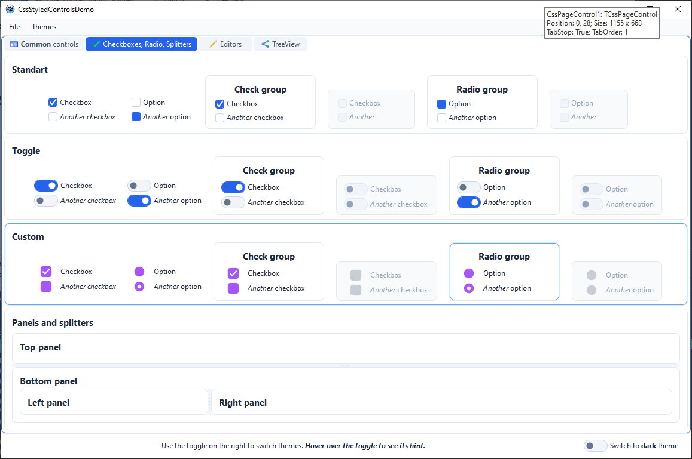
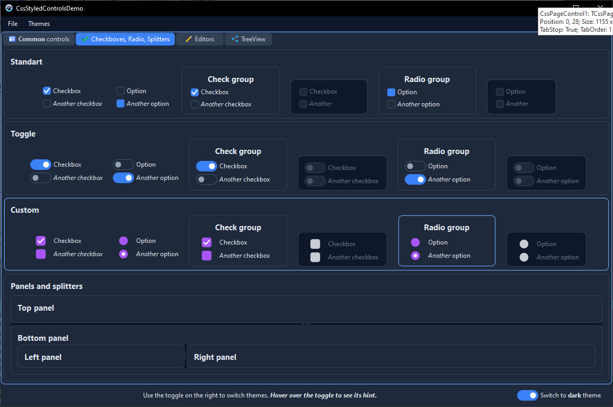
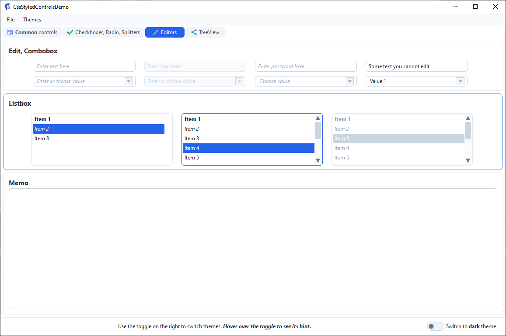
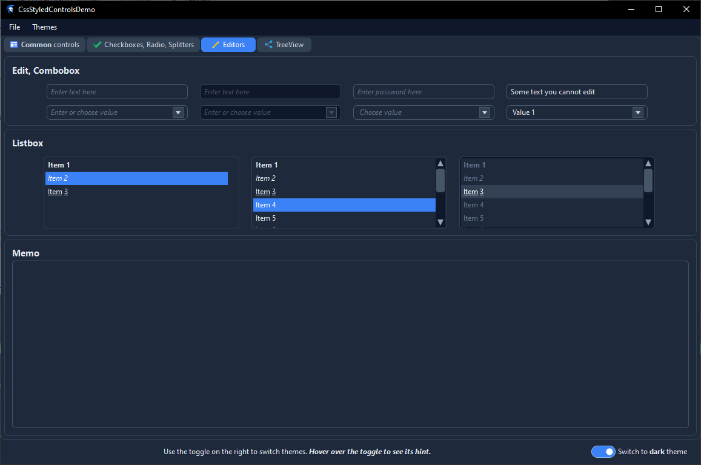
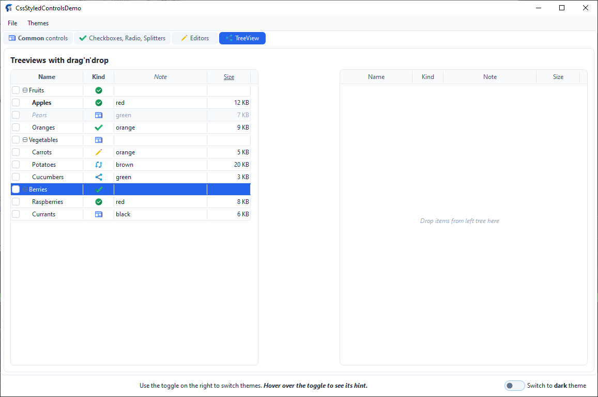
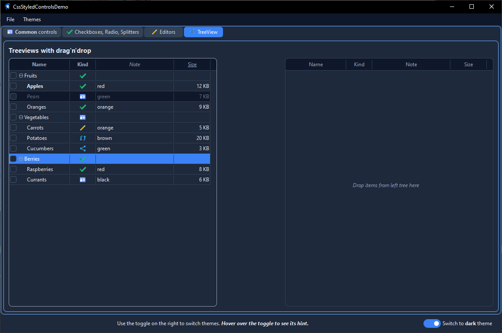

# CssStyledControls
[](LICENSE)
[](#high-dpi-support)

A set of visual controls for **Lazarus / Free Pascal (LCL)** that are fully stylable with **CSS** and support **HTML formatting** for their text content.

The library brings a modern, web-like approach to desktop GUI development: instead of tweaking dozens of properties by hand, you describe the look of every control in a single CSS file — complete with selectors, pseudo-classes, cascading, specificity, CSS variants (themes), gradients, box shadows, and inline styles. A built-in `TCssProxy` component can even push the same theme onto **standard LCL controls** (`TForm`, `TButton`, `TEdit`, `TLabel`, `TPanel`).

> [!WARNING]
> **Work in progress.** The library is under active development.
> Some controls may not yet be fully functional, and parts of this documentation
> may be incomplete or out of date. APIs and behavior can change without notice.

> [!WARNING]
> **Compatibility note.** The library and demo were developed and tested in
> [Unleashed Pascal](https://unleashedpascal.org/). Functionality in other versions
> of FreePascal / Lazarus is not guaranteed.

---

## Table of Contents

- [Features](#features)
- [Screenshots](#screenshots)
- [Installation](#installation)
- [Quick Start](#quick-start)
- [Demo Project](#demo-project)
- [Included Controls](#included-controls)
- [CSS Overview](#css-overview)
- [General CSS Properties](#general-css-properties)
- [Per-Control CSS Properties](#per-control-css-properties)
- [SVG Image Lists (TCssSvgImgList)](#svg-image-lists-tcsssvgimglist)
- [Menus (TCssMainMenu, TCssPopupMenu)](#menus-tcssmainmenu-tcsspopupmenu)
- [Tabs (TCssTabControl, TCssPageControl)](#tabs-tcstabcontrol-tcspagecontrol)
- [Tree Icons (TCssVirtualStringTree)](#tree-icons-tcssvirtualstringtree)
- [Themes (Light and Dark)](#themes-light-and-dark)
- [HTML Formatting](#html-formatting)
- [Link Handling](#link-handling)
- [Tooltips with CSS and HTML](#tooltips-with-css-and-html)
- [Style Provider API](#style-provider-api)
- [Proxy Styling for Standard LCL Controls](#proxy-styling-for-standard-lcl-controls)
- [High DPI Support](#high-dpi-support)
- [Native Form Title Bar (Windows)](#native-form-title-bar-windows)
- [Design-Time Support](#design-time-support)
- [Example Theme](#example-theme)
- [License](#license)

---

## Features

- **Full CSS styling** — every control reads its appearance from CSS rules: background, gradients, borders, per-corner radii, padding, fonts, colors, alignment, opacity, text shadows, box shadows, cursors, and more.
- **CSS selectors** — match by class name, `CssTag`, `CssID`, `CssClass`, pseudo-classes and combinators.
- **Pseudo-classes** — `:hover`, `:active`, `:focus`, `:focus-visible`, `:enabled`, `:disabled`, `:checked`, `:unchecked`, `:default`, `:cancel`.
- **Cascading and specificity** — later rules and more specific rules win, exactly like in the browser.
- **Themes / variants** — a single CSS file can contain several `@variant <name> { ... }` blocks (e.g. `light` and `dark`), switchable at runtime through `TCssStyleProvider`.
- **Gradients** — `linear-gradient(...)` and `radial-gradient(...)` with angles (`deg`, `grad`, `rad`, `turn`, `to …`) and color stops.
- **Box shadows** — `box-shadow: <dx> <dy> <blur> <spread> <color>` on any control.
- **Per-corner radii** — `border-radius` accepts 1–4 values (`TL TR BR BL`).
- **HTML text rendering** — `HtmlMode` renders captions, list items, menu items, tree cells, and hints as HTML with inline styles, lists, headings, code blocks, links, etc.
- **Clickable links** — `<a href="...">` inside HTML content raises `OnLinkClick`, changes the cursor, and supports `a`, `a:hover`, `a:active` CSS rules.
- **CSS-styled tooltips** — tooltips can be styled with the `::hint` selector and rendered as HTML.
- **Windows 11-style switches** — set `checkbox-style: toggle` / `radio-style: toggle` on a checkbox / radio button (or on a `toggle` class) to render them as pill switches with an animated thumb.
- **Tree icons from SVG** — `TCssVirtualStringTree` accepts a `TCssSvgImgList` and requests a per-cell icon through `OnGetImageIndex`, with DPI-aware sizing, per-theme variants, and automatic `currentColor` tinting.
- **Nested child styling** — composite controls (`TCssComboBox`, `TCssCheckGroup`, `TCssRadioGroup`, `TCssListBox`, `TCssVirtualStringTree`, tabs) expose `*CssClass` / `*CssStyle` properties so you can style their internal children too.
- **Focus-within** — a parent (`TCssPanel`, `TCssGroupBox`, `TCssCheckGroup`, `TCssRadioGroup`, `TCssComboBox`, `TCssTabControl`, `TCssPageControl`) can highlight its border while a child has focus (`focus-within: true`).
- **Standard LCL styling** — `TCssProxy` reads the active CSS variant and applies `background`, `color`, `font-*`, and `text-align` to plain LCL `TButton`, `TEdit`, `TLabel`, `TPanel`, and forms.
- **Anti-aliased rendering** — rounded boxes, circles, triangles, check marks, and focus rings are drawn with sub-pixel coverage and cached bitmaps.
- **No external dependencies** — pure LCL, works on Windows, Linux, and macOS.

---

## Screenshots

Each tab of the demo project is shown in both variants of the bundled
`ModernTheme.css` — `light` and `dark`. In every pair the two screenshots
come from the *same* running form, switched at runtime by the toggle in the
status bar; only the active `@variant` changes.

### Common controls

Buttons, `TCssBitBtn`s with built-in and custom SVG glyphs, an HTML label,
and a `TCssPopupMenu`.

| Light | Dark |
| :---: | :---: |
|  |  |

### Checkboxes, Radio, Splitters

Standard checkboxes and radio buttons, Windows 11-style switches
(`.toggle`), check / radio groups with `focus-within`, and a set of
panels separated by splitters.

| Light | Dark |
| :---: | :---: |
|  |  |

### Editors

`TCssEdit` (plain, disabled, password, read-only), `TCssComboBox` in
all four supported states, `TCssListBox`, and `TCssMemo`.

| Light | Dark |
| :---: | :---: |
|  |  |

### TreeView

Two `TCssVirtualStringTree`s with columns, per-cell SVG icons, checkboxes,
inline editing, and drag & drop between the trees.

| Light | Dark |
| :---: | :---: |
|  |  |
---

## Installation

1. Clone the repository:

   ```bash
   git clone https://github.com/avavdoshin/CssStyledControls.git
   ```

2. Open the runtime package `Packages/CssStyledControls.lpk` in Lazarus (`Package → Open Package File…`).

3. Click **Compile**, then **Use → Install**.

4. Open the design-time package `Packages/CssStyledControlsDesign.lpk` and install it too. It adds:

   - a **multi-line CSS editor** for `TCssStyleProvider.CssText`,
   - a **file picker** for `TCssStyleProvider.FileName`,
   - a **component editor** with an `Edit CSS…` verb on `TCssStyleProvider`,
   - a **page editor** (`New Page`, `Delete Page`, `Next Page`, `Previous Page`) on `TCssPageControl`,
   - a **visual menu designer** for `TCssMainMenu` / `TCssPopupMenu`,
   - a **Columns Editor** for `TCssVirtualStringTree.Columns`,
   - a **shortcut picker** (with ~150 common shortcuts) for `TCssMenuItem.Shortcut`.

5. The component palette gets a new tab `CSSStyledControls`:

   `TCssStyleProvider`, `TCssProxy`, `TCssButton`, `TCssBitBtn`, `TCssCheckBox`, `TCssCheckGroup`, `TCssComboBox`, `TCssEdit`, `TCssGroupBox`, `TCssLabel`, `TCssListBox`, `TCssMemo`, `TCssMainMenu`, `TCssPopupMenu`, `TCssPanel`, `TCssRadioButton`, `TCssRadioGroup`, `TCssScrollBar`, `TCssSplitter`, `TCssVirtualStringTree`, `TCssPageControl`, `TCssTabControl`, `TCssTabSheet`.

   `TCssMenuItem` is not shown on the palette: it is created and edited only through the visual menu designer.

---

## Quick Start

1. Drop a `TCssStyleProvider` onto a form (or a data module).
2. Fill its `CssText` property (or set `FileName` to a `.css` file), for example:

   ```css
   TCssButton {
     background-color: #2563EB;
     color: #FFFFFF;
     border: 1px solid #2563EB;
     border-radius: 6px;
     padding: 6px 14px;
     text-align: center;
     vertical-align: middle;
   }
   TCssButton:hover    { background-color: #1D4ED8; }
   TCssButton:active   { background-color: #1E40AF; }
   TCssButton:disabled {
     background-color: #F1F5F9;
     color: #94A3B8;
     border-color: #E2E8F0;
   }
   ```

3. Drop a `TCssButton` (or any other `TCss*` control) onto the same form and assign its `StyleProvider` property to the provider created in step 1. Every control that references the provider is automatically restyled whenever the CSS text changes.

4. (Optional) Set `HtmlMode := True` on a control and use HTML in its `Caption`:

   ```html
   <b>Save</b> <span style="color:#f00">now</span>
   ```

5. (Optional) For a light/dark theme, wrap your rules in `@variant` blocks:

   ```css
   @variant light
   {
     TCssButton { background-color: #F1F5F9; color: #1E293B; }
   }

   @variant dark
   {
     TCssButton { background-color: #334155; color: #E2E8F0; }
   }
   ```

   and toggle it in code:

   ```pascal
   CssStyleProvider1.DefaultStyleName := 'dark';
   ```

6. (Optional) For a button with an icon, use `TCssBitBtn`:

   ```pascal
   CssBitBtn1.Kind := bkOK;                          // built-in "OK" icon + label
   CssBitBtn1.Layout := ...                          // set through CSS instead
   ```

   ```css
   TCssBitBtn {
     glyph-layout: left;
     glyph-spacing: 6px;
     glyph-margin: auto;
   }
   ```
---
## Demo Project

A ready-to-run demonstration lives in the `Demo` folder:

```
Demo/CssStyledControlsDemo.lpr
Demo/Unit1.pas
Demo/Unit1.lfm
```

Open `CssStyledControlsDemo.lpi` in Lazarus and press **F9**. The demo is
wired so that almost everything is driven by CSS and by events — Pascal
code is only used where a demo cannot avoid it (populating the tree,
switching the theme, copying nodes on cross-tree drops).

The form is organised as a `TCssPageControl` with four tabs, plus a
bottom status panel and a top menu bar.

### Page 1 — Common controls

- A `TCssPageControl` whose **tab strip is decorated with SVG icons**.
  The page itself carries the icon (`CssTabSheet1.ImageIndex = 1`), so the
  tab automatically displays the second entry of the shared
  `TCssSvgImgList1` (`icons8-news`). The icon follows the tab text color
  in every state — plain, hovered, active — and switches to the `dark`
  variant of that entry together with the CSS theme.

- A `TCssGroupBox` containing several `TCssButton`s (enabled, disabled,
  default, cancel, and one with a `TCssPopupMenu`).

- Four `TCssBitBtn` controls next to those buttons, covering every glyph
  source the control supports:
  - `Kind = bkCancel` with a custom caption (`UseKindCaption = False`) —
    a **built-in vector icon** paired with a user-supplied label.
  - the same `Kind = bkCancel`, but `Enabled = False` — the same glyph is
    rendered in its **muted disabled variant**, in tone with the disabled
    caption.
  - a **custom SVG glyph** (`SvgImages = CssSvgImgList1`, `ImageIndex = 0`)
    — a 32×32 vector icon rasterised at the current DPI and drawn next to
    an HTML caption (`Custom <b>SVG</b>`, `HtmlMode = True`).
  - the same SVG glyph with `Enabled = False` — the rasteriser desaturates
    the RGBA image in place (transparent pixels stay transparent,
    anti-aliased edges are preserved) and re-tints it to match the
    disabled text color, so no box appears behind the icon.

- A non-visual `TCssSvgImgList` (`CssSvgImgList1`) holding the SVG sources
  for the whole demo. It is configured at `32 × 32` design-time size with
  `Scaled = True`, so every icon is always rendered at the current DPI,
  and ships with **six 48×48 icons**:
  - `icons8-ok` — a gradient circle with a white checkmark. This entry
    has **per-theme variants**: its base `Svg` is the light artwork, and
    its `Variants` list carries an alternative `dark` body with a muted
    green gradient.
  - `icons8-news` — a blue newspaper-style icon, used by the tab strip.
  - `icons8-edit` — a pencil-on-paper icon, used by `MenuItem1` in the
    popup menu.
  - `icons8-done`, `icons8-refresh`, `icons8-share` — additional
    entries used by the two trees on the *TreeView* tab.

- A `TCssPopupMenu` (`CssPopupMenu1`) whose icons are sourced **once at
  the menu level**: `CssPopupMenu1.SvgImages := CssSvgImgList1`. Every
  item can then simply set its own `ImageIndex` — `MenuItem1` uses `2`
  (`icons8-edit`), and `MenuItem2` leaves it at `-1`, so the icon column
  is not reserved when no item in the menu has an icon.

- A `TCssPanel` with a `TCssLabel` whose `Caption` is HTML demonstrating
  every supported tag: headings, bold / italic / underline / strike /
  code / kbd / samp / tt / sup / sub / `<q>`, alignment via both
  `align="…"` and `style="text-align:…"`, ordered and unordered lists,
  inline colors, legacy `<font color>`, spans, and clickable `<a>` links.

### Page 2 — Checkboxes, Radio, Splitters

- Two rows of standalone controls: plain `TCssCheckBox` / `TCssRadioButton`
  in the *Standart* panel, and the same controls with
  `CssClass = 'toggle'` in the *Toggle* panel, which turns them into
  Windows 11-style pill switches.

- Four `TCssCheckGroup` / `TCssRadioGroup` combinations covering the two
  visual styles side by side, plus two disabled groups without captions
  that show how `:disabled` propagates to children.

- A `TCssPanel` with **splitters**: one horizontal splitter between a
  *Top panel* and a *Bottom panel*, and one vertical splitter between
  a *Left panel* and a *Right panel*. The panels demonstrate
  `focus-within: true` and the hover border transition.

### Page 3 — Editors

- Four `TCssEdit` controls: normal, disabled, password (`PasswordChar = '*'`,
  `MaxLength = 10`), and read-only (`Caption` preset, all editing disabled).
  Every one uses the `placeholder-color` / `placeholder-font-style`
  declarations from CSS to render a muted italic placeholder.

- Four `TCssComboBox` controls covering both combo styles:
  - `ccsDropDown` — editable, HTML items, `Placeholder = 'Enter or choose value'`.
  - `ccsDropDown` (disabled) — same, with the muted palette from `:disabled`.
  - `ccsDropDownList` — selection-only, ten items, `Placeholder = 'Choose value'`.
  - `ccsDropDownList` (`ReadOnly = True`) — same, but the dropdown cannot
    be opened and the arrow keys do not change the selection.

- Three `TCssListBox` controls: a short list, a long list with a custom
  scrollbar (`.listbox-scrollbar`), and a disabled list with a
  pre-selected item to show the disabled selection colors.

- A `TCssMemo` with `ssAutoBoth` scrollbars and `.memo-scrollbar` styling,
  filling the rest of the tab.

### Page 4 — TreeView

- Two `TCssVirtualStringTree`s (`LeftTree` and `RightTree`) configured
  **identically**, so that any node can be dropped from one into the
  other. Each tree has:
  - **four columns** — *Name*, *Kind*, *Note*, *Size* — with HTML headers
    (`<b>Name</b>`, `<i>Note</i>`, `<u>Size</u>`), per-column alignment
    (`CellHAlign = thaCenter` on *Kind*, `thaRight` on *Size*), and
    `LastColumnStretch = True` so the *Size* column fills the remaining
    width.
  - **per-cell SVG icons** in the *Kind* column, sourced from
    `CssSvgImgList1` through `OnGetImageIndex`. The event returns
    `D^.Kind` for column 1 and `-1` for the others, so the icon column
    is reserved only where icons actually exist.
  - **checkboxes** (`ShowCheckboxes = True`) with the
    `.css-tree-checkbox .checkbox` class inherited from the base
    `TCssCheckBox`.
  - **inline editing** (`AllowEditing = True`). `OnEditing` blocks column
    3 (*Size*) so the numeric column stays read-only;
    `OnNewText` writes the typed value back to the correct field based
    on `Column`, and applies `PlainTextToHtml` only to column 0.
  - **drag & drop** (`AllowDrag = True`, `AllowDrop = True`). Dropping a
    node (or a multi-selection) onto another tree creates a full copy of
    the subtree in the target and deletes the original from the source,
    preserving `cvsChecked`, `cvsExpanded`, and `cvsDisabled` states.
    `OnDragOverNodes` prevents dropping on a disabled node, and rejects
    dragging disabled nodes at all.
  - a **placeholder** shown when the tree is empty
    (`Drop items from left tree here` / `…from right tree here`).

- The left tree is populated in `FormCreate` with three root groups
  (*Fruits*, *Vegetables*, *Berries*) and a mixture of HTML captions,
  notes, icon indexes, and sizes. One node (*Pears*) is disabled to
  demonstrate the muted palette for `:disabled` rows.

### Status bar and menu

- A `TCssCheckBox` styled as a Windows 11 switch (`.toggle` class) that
  switches the whole application between the **light** and **dark**
  variants by setting `CssStyleProvider1.DefaultStyleName`. Its `Hint`
  is itself written in HTML — `<h6>`, `<hr>` and `<li>` render through
  the CSS-styled hint window.

- A `TCssMainMenu` with *File* and *Themes* dropdowns. *Switch theme*
  (`MenuItem5`) toggles the same switch as the status bar, and the *File*
  menu carries a separator to show how `menu-separator-color` and
  `menu-separator-height` are applied.

- A `TCssProxy` that applies the same theme to the plain `TForm`.

The relevant demo handlers are tiny:

```pascal
procedure TForm1.CssCheckBox1Click(Sender : TObject);
begin
  if CssCheckBox1.Checked then
    CssStyleProvider1.DefaultStyleName := 'Dark'
  else
    CssStyleProvider1.DefaultStyleName := 'Light';
end;

procedure TForm1.CssLabel2LinkClick(Sender : TObject;
  const AHref, AText : UnicodeString);
begin
  MessageDlg('Link clicked', 'Href='+AHref+' , Text='+AText,
    mtInformation, [mbOk], '');
end;

procedure TForm1.LeftTreeNewText(Sender : TObject; Node : TCssVirtualNode;
  Column : Integer; const NewText : string);
var
  D: PNodeData;
  Tree: TCssVirtualStringTree;
begin
  if not Assigned(Node.Data) then Exit;

  D := PNodeData(Node.Data);
  Tree := TCssVirtualStringTree(Sender);

  case Column of
    0: D^.Caption := Tree.PlainTextToHtml(NewText);
    2: D^.Note    := Tree.PlainTextToHtml(NewText);
    3: D^.Size    := StrToIntDef(Trim(NewText), D^.Size);
  end;
end;

procedure TForm1.LeftTreeDropNodesEx(Sender : TObject;
  SourceTree : TCssVirtualStringTree; Nodes : TList;
  TargetNode : TCssVirtualNode);
begin
  // Cross-tree drop: copy every node into the target, then delete the
  // originals from the source. Same-tree drops fall back to the built-in
  // MoveNodes.
end;
```

Switching the toggle changes the CSS theme **and** every SVG icon at the
same time — the tab-strip icon, both `TCssBitBtn` glyphs, the popup menu
item icon, and every cell icon in both trees all move to their `dark`
variants in one step, without a single line of code in the form.
---

## Included Controls

| Control                   | Description                                                                  |
| ------------------------- | ---------------------------------------------------------------------------- |
| `TCssStyledControl`       | Base class of all CSS-styled controls. Contains the CSS engine, the HTML parser, and the AA renderer. |
| `TCssStyleProvider`       | Non-visual component that holds CSS text and pushes it to controls.          |
| `TCssSvgImgList`          | Non-visual component that stores images in native SVG format, optionally with **per-theme variants** (`dark`, `light`, …), and renders them on demand with HiDPI and anti-aliasing. Drop-in replacement for `TImageList` when vector icons are preferred. |
| `TCssProxy`               | Non-visual component that applies the active CSS variant to plain LCL controls (`TForm`, `TButton`, `TEdit`, `TLabel`, `TPanel`). |
| `TCssButton`              | Push button with `Default`, `Cancel`, `ModalResult`, and `:default` / `:cancel` pseudo-classes. |
| `TCssBitBtn`              | Button with a glyph (icon) next to the caption. Supports standard `TBitBtn.Kind` icons, custom bitmaps (`Glyph` + `NumGlyphs`), `TImageList`, `TCssSvgImgList`, per-state image indexes (`ImageIndexDisabled` / `Pressed` / `Focused`), HiDPI-aware rendering, and CSS-driven icon layout. |
| `TCssCheckBox`            | Tri-state check box with an optional Windows 11-style **switch** appearance. |
| `TCssCheckGroup`          | Group of check boxes laid out in columns, with per-item state.               |
| `TCssRadioButton`         | Radio button with an optional Windows 11-style **switch** appearance.        |
| `TCssRadioGroup`          | Group of radio buttons laid out in columns.                                  |
| `TCssComboBox`            | Dropdown combo box (`ccsDropDown`, `ccsDropDownList`).                       |
| `TCssEdit`                | Single-line editor with selection, clipboard, undo, placeholder styles.      |
| `TCssMemo`                | Multi-line editor with word-wrap, scrollbars, selection, clipboard, colored caret and placeholder. |
| `TCssLabel`               | Label with `FocusControl`, `ShowAccelChar`, `Transparent`.                   |
| `TCssListBox`             | List box with multi-select, hover, per-item colors, custom scrollbar.        |
| `TCssPanel`               | Container panel with `focus-within` support.                                 |
| `TCssGroupBox`            | Group box with caption on the border and `focus-within` support.             |
| `TCssScrollBar`           | Custom scrollbar (can be drawn standalone or inside another control).        |
| `TCssSplitter`            | Splitter with grip, live/ghost preview, and adjacent-control highlighting.   |
| `TCssMainMenu`            | Menu bar with dropdowns.                                                     |
| `TCssPopupMenu`           | Popup menu component (non-visual) with `Popup` / `AutoPopup`.                |
| `TCssMenuItem`            | Single menu item. Hidden from the palette; edited by the visual menu designer. |
| `TCssTabControl`          | Tab strip without pages, with optional overflow scroll buttons.              |
| `TCssPageControl`         | Tab control with pages (`TCssTabSheet`).                                     |
| `TCssTabSheet`            | A single page of a `TCssPageControl`.                                        |
| `TCssVirtualStringTree`   | Virtual tree view with columns, checkboxes, **SVG cell icons**, editing, sorting, drag & drop, per-cell alignment, lazy loading, and incremental search. |
---

## CSS Overview

### Where the CSS Lives

There are three ways to give a control its CSS rules, applied in this order (later sources override earlier ones):

1. `TCssStyleProvider` — the recommended way for an application-wide theme. Assign the provider to a control's `StyleProvider` property.
2. `StyleName` — selects a specific variant inside the provider. If empty, the provider's `DefaultStyleName` is used.
3. `CssStyle` — inline declarations applied after everything else. Equivalent to the HTML `style="..."` attribute.

Additionally, `CssTag`, `CssID`, and `CssClass` define how the control is matched by selectors.

### Selectors

A selector is a chain of simple selectors. The engine parses the **last** simple selector in the chain (descendant/child combinators are accepted but only the rightmost part is matched, like in simplified CSS).

Supported simple selector components:

| Syntax                     | Matches                                                                  |
| -------------------------- | ------------------------------------------------------------------------ |
| `*`                        | Any control.                                                             |
| `Name`                     | The control's class name (`TCssButton`), `CssTag`, `'control'`, or `'TCssStyledControl'`. |
| `#id`                      | `CssID`.                                                                 |
| `.class`                   | One of the classes in `CssClass` (space-separated list, several allowed). |
| `:pseudo`                  | A pseudo-class (see below).                                              |
| `a`, `a:hover`, `a:active` | Rules for HTML links inside `HtmlMode` text.                             |
| `::hint`                   | Rules for the control's tooltip.                                         |

Example:

```css
TCssButton                 { /* by class name */ }
button.primary             { /* by tag + class  */ }
#saveButton                { /* by id           */ }
TCssButton:hover           { /* pseudo-class    */ }
a                          { /* html link       */ }
a:hover                    { /* hovered link    */ }
::hint                     { /* tooltip         */ }
.toggle                    { /* class selector  */ }
```

### Pseudo-Classes

| Pseudo-class       | Active when…                                            |
| ------------------ | ------------------------------------------------------- |
| `:hover`           | The mouse is over the control.                          |
| `:active`          | The left mouse button is pressed on the control.        |
| `:focus`           | The control has focus.                                  |
| `:focus-visible`   | Same as `:focus`.                                       |
| `:enabled`         | `Enabled = True`.                                       |
| `:disabled`        | `Enabled = False`.                                      |
| `:checked`         | `Checked = True`.                                       |
| `:unchecked`       | `Checked = False`.                                      |
| `:default`         | (`TCssButton` only) `Default = True`.                   |
| `:cancel`          | (`TCssButton` only) `Cancel = True`.                    |

### Specificity and Cascade

Rules are sorted by a simplified specificity tuple, then by source order:

1. **A** — number of `#id` parts (`0` or `1`).
2. **B** — number of `.class` and `:pseudo` parts.
3. **C** — `1` if a type/tag name was present, else `0`.

If everything is equal, rules that appear later in the CSS text win. Inline styles (`CssStyle`) are applied last of all.

### Themes (Variants)

A single CSS text may contain several named variants. Each variant starts with a marker:

```css
@variant light
{
  TCssButton { background-color: #2563EB; color: #FFFFFF; }
}

@variant dark
{
  TCssButton { background-color: #3B82F6; color: #FFFFFF; }
}
```

The alternative bracket syntax is also accepted:

```css
[light]
TCssButton { /* ... */ }

[dark]
TCssButton { /* ... */ }
```

Everything between one `@variant` marker and the next belongs to that variant. Rules placed **before** the first marker belong to `DefaultStyleName`.

At runtime, choose the theme by setting the provider's `DefaultStyleName` or a control's `StyleName`:

```pascal
CssStyleProvider1.DefaultStyleName := 'dark';
// or per control:
CssButton1.StyleName := 'dark';
```

A file without any `@variant` marker is treated as a single variant named by `DefaultStyleName` (`'default'` by default).

---

## General CSS Properties

These declarations are understood by **every** `TCssStyledControl` descendant.

### Background

| Property              | Example                                | Notes                                                       |
| --------------------- | -------------------------------------- | ----------------------------------------------------------- |
| `background`          | `background: #fff;`                    | Shorthand; picks the first color token, or a gradient if the value is `*-gradient(...)`. |
| `background-color`    | `background-color: transparent;`       | `transparent` means "do not fill".                          |
| `background-image`    | `background-image: linear-gradient(…)` | Supports `linear-gradient(...)` and `radial-gradient(...)`. |

### Gradients

```css
TCssPanel {
  background-image: linear-gradient(180deg, #2563EB 0%, #1E40AF 100%);
}

TCssPanel.radial {
  background-image: radial-gradient(#FFFFFF 0%, #CBD5E1 100%);
}
```

Supported angle units: `deg`, `grad`, `rad`, `turn`, and the `to <side>` / `to <corner>` keywords. Color stops accept `%` positions; missing positions are interpolated automatically.

### Text

| Property          | Values                                        | Notes                                                  |
| ----------------- | --------------------------------------------- | ------------------------------------------------------ |
| `color`           | CSS color                                     | Text color.                                            |
| `text-align`      | `left` \| `center` \| `right`                 | Horizontal alignment of caption/text.                  |
| `vertical-align`  | `top` \| `middle` / `center` \| `bottom`      | Vertical alignment.                                    |
| `text-shadow`     | `1px 1px #000` / `none`                       | `<dx> <dy> [color]`.                                   |
| `font`            | `italic bold 12pt 'Segoe UI'`                 | Shorthand; the first recognized size wins.             |
| `font-family`     | `'Segoe UI', Arial, sans-serif`               | First family found on the system wins; keyword families are resolved. |
| `font-size`       | `12pt` \| `14px` \| `medium` \| `large` …     | `pt` is converted to px.                               |
| `font-weight`     | `normal` \| `bold` \| `100`…`900`             | 600 and above ⇒ bold.                                  |
| `font-style`      | `normal` \| `italic` \| `oblique`             |                                                        |

Generic families `serif`, `sans-serif`, `monospace`, `cursive`, `fantasy`, and `system-ui` are mapped to real fonts on the current system.

### Border

| Property          | Example                                    | Notes                                                  |
| ----------------- | ------------------------------------------ | ------------------------------------------------------ |
| `border`          | `1px solid #ccc`                           | Shorthand for width / style / color.                   |
| `border-width`    | `1px`, `2px`, `thin`, `medium`, `thick`    |                                                        |
| `border-color`    | `#cccccc`                                  |                                                        |
| `border-style`    | `none` \| `solid` \| `dotted` \| `dashed`  |                                                        |
| `border-radius`   | `6px` \| `6px 4px` \| `6px 4px 2px` \| `6px 4px 2px 0` | 1–4 values, CSS shorthand (`TL TR BR BL`). |

### Spacing

| Property                                                          | Notes                            |
| ----------------------------------------------------------------- | -------------------------------- |
| `padding`                                                         | 1–4 values, CSS shorthand.       |
| `padding-top`, `padding-right`, `padding-bottom`, `padding-left`  | Individual sides.                |

### Interaction and Effects

| Property       | Values                                | Notes                                                |
| -------------- | ------------------------------------- | ---------------------------------------------------- |
| `cursor`       | `pointer`, `text`, `wait`, `move`, `not-allowed`, `no-drop`, `help`, `crosshair`, `progress`, `e-resize`, `w-resize`, `n-resize`, `s-resize`, `ne-resize`, `sw-resize`, `nw-resize`, `se-resize`, `col-resize`, `row-resize`, `default`, … | Maps to LCL cursor constants. |
| `opacity`      | `0.0` … `1.0` (or `50%`)              | Blends the control's colors with its parent color.   |
| `focus-color`  | CSS color                             | Color of the focus rectangle.                        |
| `focus-within` | `true` \| `false`                     | (Composite controls) highlight the parent while a child has focus. |
| `box-shadow`   | `2px 2px 4px 1px rgba(0,0,0,.25)`     | `<dx> <dy> [blur] [spread] [color]`. Supports `inset` (parsed and ignored). |

### Colors

The following formats are accepted anywhere a color is expected:

- `#RGB`, `#RGBA`, `#RRGGBB`, `#RRGGBBAA`
- `rgb(r, g, b)`, `rgba(r, g, b, a)` with values `0..255` or `0..100%`
- Named colors: `black`, `white`, `red`, `green`, `blue`, `yellow`, `orange`, `purple`, `gray` / `grey`, `silver`, `maroon`, `olive`, `lime`, `aqua` / `cyan`, `teal`, `navy`, `fuchsia` / `magenta`, `pink`, `brown`, `gold`, `khaki`, `beige`, `ivory`, `snow`, `tomato`, `coral`, `salmon`, `darkgray`, `lightgray`, `dimgray`, `whitesmoke`
- `transparent`

### Lengths

Lengths accept `px`, `pt` (converted to px at 96 DPI), unit-less numbers (treated as px), and the keywords `thin` (1), `medium` (2), `thick` (4).
---

## Per-Control CSS Properties

Each control adds its own set of declarations on top of the general ones. All of them are reset by `ResetStyle` and can be overridden via `:hover`, `:active`, `:focus`, `:disabled`, `:checked`, etc.

### TCssButton

No extra properties. Use the standard pseudo-classes plus `:default` and `:cancel`.

Additional Pascal properties: `Default`, `Cancel`, `ModalResult`.

```css
TCssButton:default { background-color: #2563EB; color: #FFFFFF; }
TCssButton:cancel  { background-color: #FEF2F2; color: #B91C1C; }
```

### TCssBitBtn — Button with Glyph

`TCssBitBtn` is a descendant of `TCssButton` that adds a bitmap glyph next to the caption, in the spirit of the classic `TBitBtn`. Because it inherits from `TCssButton`, every `TCssButton` rule in your CSS still applies — the bit button only adds three extra `glyph-*` properties and the ability to source an icon.

#### Glyph Source Priority

The control can draw a glyph from four sources, in this order (highest priority first):

1. **`Kind` ≠ `bkCustom`** — a built-in vector icon, plus a standard caption.
2. **`SvgImages` + `ImageIndex`** — an image from a `TCssSvgImgList`. The SVG is rasterised on demand, at the current DPI, with anti-aliasing, and tinted with the effective text color from CSS.
3. **`Images` + `ImageIndex`** — an image from a `TImageList`.
4. **`Glyph`** — a user-supplied `TBitmap`, optionally split into 1–4 states via `NumGlyphs`.

As soon as a source yields a valid image index, the next sources in the list are ignored. When no glyph is available at all, `TCssBitBtn` behaves exactly like a plain `TCssButton`.

#### Pascal Properties

| Property               | Type               | Default      | Notes                                                                 |
| ---------------------- | ------------------ | ------------ | --------------------------------------------------------------------- |
| `Kind`                 | `TCssBitBtnKind`   | `bkCustom`   | One of: `bkCustom`, `bkOK`, `bkCancel`, `bkHelp`, `bkYes`, `bkNo`, `bkClose`, `bkAbort`, `bkRetry`, `bkIgnore`, `bkAll`. |
| `Glyph`                | `TBitmap`          | empty        | User bitmap. Assigning a non-empty bitmap resets `Kind` to `bkCustom`. |
| `NumGlyphs`            | `Integer`          | `1`          | 1–4: how many sub-images the `Glyph` bitmap is split into, stacked vertically. Ignored for `SvgImages`, `Images` and `Kind`. |
| `Images`               | `TCustomImageList` | `nil`        | Source of the glyph when `Kind = bkCustom` and no `SvgImages` is set.  |
| `SvgImages`            | `TCssSvgImgList`   | `nil`        | Preferred source of the glyph when `Kind = bkCustom`. Takes priority over `Images`. See [SVG Image Lists](#svg-image-lists-tcsssvgimglist). |
| `ImageIndex`           | `Integer`          | `-1`         | Index for the normal state, inside `SvgImages` or `Images`. `-1` disables this source. |
| `ImageIndexDisabled`   | `Integer`          | `-1`         | Index for the disabled state. `-1` means "fall back to `ImageIndex`". See below. |
| `ImageIndexPressed`    | `Integer`          | `-1`         | Index for the pressed (`:active`) state. `-1` means "fall back to `ImageIndex`". |
| `ImageIndexFocused`    | `Integer`          | `-1`         | Index for the focused state. `-1` means "fall back to `ImageIndex`".   |
| `Transparent`          | `Boolean`          | `True`       | Whether `Glyph` uses transparency.                                     |
| `GlyphScaled`          | `Boolean`          | `False`      | If `True`, `Glyph` and `Images` are stretched by the current DPI factor. The `SvgImages` and `Kind` sources are always DPI-scaled. |
| `UseKindCaption`       | `Boolean`          | `True`       | If `True`, changing `Kind` overwrites `Caption` with the standard label. If `False`, your own caption is preserved. Automatically set to `False` the first time you assign a caption that does not match the current `Kind`'s default. |
| `GlyphLayout`          | `TCssButtonLayout` | `blGlyphLeft` | Read-only. Reflects the effective value parsed from CSS.             |
| `GlyphSpacing`         | `Integer`          | —            | Read-only. Effective spacing in **device pixels**.                    |
| `GlyphMargin`          | `Integer`          | —            | Read-only. Effective margin in **device pixels**, or `-1` for "use CSS padding". |

#### Per-State Image Indexes

For the `SvgImages` and `Images` sources, `ImageIndex` selects the glyph for the normal state, and the three extra properties override it for the specific states:

| State                        | Index used                                              |
| ---------------------------- | ------------------------------------------------------- |
| Normal                       | `ImageIndex`                                            |
| `Enabled = False`            | `ImageIndexDisabled`, if `>= 0`; otherwise `ImageIndex` |
| Pressed (`:active`)          | `ImageIndexPressed`, if `>= 0`; otherwise `ImageIndex`  |
| Focused                      | `ImageIndexFocused`, if `>= 0`; otherwise `ImageIndex`  |

Only one state applies per paint. The lookup order matches the glyph state machine: disabled → pressed → focused → normal, so a disabled button always uses `ImageIndexDisabled` even if it is also focused or pressed.

If a dedicated disabled image is provided via `ImageIndexDisabled`, that image is used **as is** — the automatic muted-tint treatment described below is skipped. This is the recommended way to ship hand-crafted disabled artwork.

#### `NumGlyphs` and Glyph States

When a user `Glyph` is assigned, `NumGlyphs` tells the control how the source bitmap is split. States are selected automatically:

| `NumGlyphs` | State 0 (normal) | State 1 (disabled) | State 2 (pressed) | State 3 (focused) |
| ----------- | ---------------- | ------------------ | ----------------- | ----------------- |
| 1           | ✓                | —                  | —                 | —                 |
| 2           | ✓                | ✓                  | —                 | —                 |
| 3           | ✓                | ✓                  | ✓                 | —                 |
| 4           | ✓                | ✓                  | ✓                 | ✓                 |

For `Kind` icons, `SvgImages` and `Images`, `NumGlyphs` is ignored: those sources supply a single glyph per state, and the disabled variant is generated internally if no explicit `ImageIndexDisabled` is set (see below).

#### Disabled State

When `Enabled = False`:

- If the glyph source is `Kind`, the control regenerates the vector icon in a **muted palette**: the icon is fully desaturated, its contrast is compressed toward mid-gray, and the result is blended with the effective `:disabled` text color taken from CSS. The disabled icon therefore visually matches the disabled caption in both light and dark themes, without extra configuration.
- If the source is `SvgImages` and `ImageIndexDisabled` is set, that index is used **as is** — SVG still honours the current `:disabled` text color, because the rasteriser paints `currentColor` from CSS.
- If the source is `SvgImages` and `ImageIndexDisabled` is **not** set, the alpha-aware desaturation is applied directly to the RGBA raster. Transparent pixels stay transparent, so the disabled icon has no visible box behind it. The AA edges of the icon survive too.
- If the source is a user `Glyph` with `NumGlyphs ≥ 2`, state 1 is used as is — the user already provided a dedicated disabled bitmap, no automatic desaturation is applied.
- If the source is `Glyph` with `NumGlyphs = 1` or an `Images` glyph, the bitmap is desaturated on the fly and cached. The same muted tint as above is applied.

Both enabled and disabled variants are cached, so switching `Enabled` back and forth is free.

#### CSS Properties

Three additional declarations control the icon's presentation. All three are DPI-aware.

| Property        | Values                                    | Notes                                                                                 |
| --------------- | ----------------------------------------- | ------------------------------------------------------------------------------------- |
| `glyph-layout`  | `left` \| `right` \| `top` \| `bottom`    | Position of the icon relative to the caption. Default: `left`.                        |
| `glyph-spacing` | any CSS length (`4px`, `0.3em`, `thin`)   | Gap between the icon and the caption. Scaled by the DPI factor. Default: `4px`.       |
| `glyph-margin`  | CSS length, or `auto` / `none`            | Offset of the icon+caption group from the content edge. `auto` uses the CSS `padding`. |

`glyph-margin: auto` is a special keyword: the control picks the smallest side of the current CSS `padding` as the margin. This keeps the button visually consistent when only `padding` is set on `TCssButton`.

Because `TCssBitBtn` inherits from `TCssButton`, every `TCssButton` rule applies to it as well. The three `glyph-*` properties are simply added on top, and can be overridden per theme.

#### Example

```css
TCssBitBtn {
  glyph-layout:  left;
  glyph-spacing: 6px;
  glyph-margin:  auto;
}

/* Top-aligned glyphs for toolbar-style buttons. */
TCssBitBtn.toolbar {
  glyph-layout:  top;
  glyph-spacing: 2px;
  text-align:    center;
}
```

```pascal
// SVG icon that recolors itself with the current CSS text color.
// On :disabled the raster is auto-tinted, on :active it is reused
// unless a dedicated pressed icon is provided.
CssBitBtn1.SvgImages         := CssSvgImgList1;
CssBitBtn1.ImageIndex        := CssSvgImgList1.IndexOf('save');
CssBitBtn1.ImageIndexPressed := CssSvgImgList1.IndexOf('save_pressed');
CssBitBtn1.Caption           := 'Save';
CssBitBtn1.UseKindCaption    := False;

// Built-in icon with a custom caption.
CssBitBtn2.Kind            := bkOK;
CssBitBtn2.Caption         := 'Save';
CssBitBtn2.UseKindCaption  := False;

// Bitmap glyph with 4 states (normal / disabled / pressed / down).
CssBitBtn3.Glyph.LoadFromFile('icon_states.png');
CssBitBtn3.NumGlyphs    := 4;
CssBitBtn3.GlyphScaled  := True;

// Glyph from a classic image list.
CssBitBtn4.Images     := ImageList1;
CssBitBtn4.ImageIndex := 3;
```

#### Notes and Caveats

- Assigning a non-empty `Glyph` (via the Object Inspector or in code) resets `Kind` to `bkCustom`, mirroring `TBitBtn`.
- Setting a custom `Caption` when `UseKindCaption = True` automatically flips it to `False` — the current `Kind`'s label will no longer overwrite yours. Set `UseKindCaption := True` again to restore the standard label.
- The `Kind` glyphs are drawn with the anti-aliased primitives of the base engine, so their edges are smooth at every DPI. They never use the system font, so no font substitution or missing-glyph issues occur.
- `SvgImages` is preferred over `Images`. To force the classic `TImageList` for a specific button, just leave `SvgImages` unset on that button (the property is per-control).
- The SVG icon is always rendered at the current DPI, because `TCssSvgImgList` bakes `Screen.PixelsPerInch / 96` into its own effective size. Setting `GlyphScaled` additionally multiplies the size, which is useful only when the same icon must be enlarged on purpose.
- All glyph bitmaps are cached per state and per DPI factor. `ChangeScale` regenerates them automatically when the form moves to a monitor with a different scale.
- When the source is `SvgImages`, the rendered glyph is kept as a `pf32bit` bitmap with a real alpha channel, and it is composited per-pixel onto the canvas. This is the only way the anti-aliased edges of the SVG survive on all LCL widgetsets — the `TBitmap.TransparentColor`-based path used for `Images` and `Glyph` would drop the alpha of the edges and produce a jagged outline.
- In the designer, changing `Kind` repaints the control immediately, without waiting for the next focus event.

### TCssCheckBox

| Property                  | Notes                                              |
| ------------------------- | -------------------------------------------------- |
| `checkbox-background`     | Fill color of the box.                             |
| `checkbox-border-color`   | Border color of the box.                           |
| `checkbox-border-width`   | Border width of the box.                           |
| `checkbox-radius`         | Corner radius of the box.                          |
| `check-color`             | Color of the check mark.                           |
| `checkbox-style`          | `toggle` / `switch` turns the box into a pill switch. |
| `toggle-width`            | Width of the switch track (default 40 px).         |
| `toggle-height`           | Height of the switch track (default 20 px).        |
| `toggle-thumb-color`      | Thumb color of the switch (defaults to `check-color`). |

```css
TCssCheckBox.toggle {
  checkbox-style: toggle;
  toggle-width: 40px;
  toggle-height: 20px;
  checkbox-background: #F1F5F9;
  toggle-thumb-color: #64748B;
}
TCssCheckBox.toggle:checked {
  checkbox-background: #2563EB;
  toggle-thumb-color: #FFFFFF;
}
```

### TCssRadioButton

| Property               | Notes                                              |
| ---------------------- | -------------------------------------------------- |
| `radio-background`     | Fill color of the circle.                          |
| `radio-border-color`   | Border color of the circle.                        |
| `radio-border-width`   | Border width of the circle.                        |
| `radio-radius`         | Corner radius (when < half of the box).            |
| `dot-color`            | Color of the inner dot.                            |
| `radio-style`          | `toggle` / `switch` turns the radio into a pill switch. |
| `toggle-width`         | Width of the switch track (default 40 px).         |
| `toggle-height`        | Height of the switch track (default 20 px).        |
| `toggle-thumb-color`   | Thumb color of the switch (defaults to `dot-color`). |

### TCssCheckGroup / TCssRadioGroup

Both are subclasses of `TCssGroupCaptionControl`, so they support `Caption` with `CaptionMode` (`gcmInside`, `gcmOnBorder`) and `CaptionBackgroundColor`, plus `focus-within: true`.

They expose `CheckBoxCssClass` / `CheckBoxCssStyle` (resp. `RadioCssClass` / `RadioCssStyle`) so their children are styled by a separate CSS rule:

```css
TCssCheckGroup  { /* ... */ }
.checkbox       { /* applied to the child checkboxes */ }
.toggle         { /* switch appearance for the children */ }
```

### TCssComboBox

`TCssComboBox` is a dropdown combo box that supports two modes: `ccsDropDown` (with an embedded editable field) and `ccsDropDownList` (selection only). It reads its appearance from CSS and exposes child‑control styling for the embedded editor, the popup list box, and the scrollbar.

#### CSS Properties

**Dropdown button**

| Property | Notes |
| --- | --- |
| `combo-button-background` | Fill of the dropdown button. Defaults to the control’s `background-color`, or `clBtnFace` if that is not set. |
| `combo-button-hover-background` | Fill of the dropdown button on hover. Defaults to `rgb(230,235,240)`. |
| `combo-button-active-background` | Fill of the dropdown button while pressed. Defaults to `rgb(210,220,230)`. |
| `combo-button-arrow-color` | Color of the dropdown triangle. Defaults to the control’s text color. |
| `combo-button-radius` | Corner radius of the dropdown button. Defaults to `0`. |
| `combo-button-border-color` | Border color of the dropdown button. When omitted, no border is drawn. |

**Placeholder**

These properties affect the placeholder of the combo box itself. In `ccsDropDownList` the placeholder is drawn by the combo box. In `ccsDropDown` the placeholder is passed to the embedded `TCssEdit` and is styled through that editor’s CSS (`EditCssClass` / `EditCssStyle`).

| Property | Notes |
| --- | --- |
| `placeholder-color` | Placeholder text color. Defaults to `rgb(150,150,150)`. |
| `placeholder-align` | `left` \| `center` \| `right`. Defaults to `left`. |
| `placeholder-font-weight` | `normal` \| `bold` \| `bolder`. |
| `placeholder-font-style` | `normal` \| `italic` \| `oblique`. |
| `placeholder-text-decoration` | `underline`, `line-through`, `none`. |

#### Pascal Properties

| Property | Type | Default | Notes |
| --- | --- | --- | --- |
| `Items` | `TStrings` | — | The list of items. |
| `ItemIndex` | `Integer` | `-1` | Index of the selected item. |
| `Text` | `string` | — | In `ccsDropDown`: the text of the embedded editor. In `ccsDropDownList`: the text of the selected item. |
| `SelText` | `string` | — | Read‑only. Returns the display text of the selected item. |
| `ComboStyle` | `TCssComboStyle` | `ccsDropDown` | `ccsDropDown` or `ccsDropDownList`. |
| `ReadOnly` | `Boolean` | `False` | In `ccsDropDown` it is forwarded to `TCssEdit.ReadOnly`. In `ccsDropDownList` it disables opening the dropdown and prevents changing the selected item with the keyboard. |
| `DropDownCount` | `Integer` | `8` | Maximum number of visible rows in the dropdown. Minimum `1`. |
| `ItemHeight` | `Integer` | `18` | Height of a list row. Minimum `10`. |
| `Placeholder` | `string` | `''` | Placeholder text. |

#### Child Controls CSS

| Property | Default | Notes |
| --- | --- | --- |
| `EditCssClass` | `'combobox-edit'` | CSS class of the embedded editor. |
| `EditCssStyle` | `'background-color: transparent; border: 0px solid transparent; padding: 0px;'` | Inline style of the embedded editor. |
| `ListBoxCssClass` | `'combobox-list'` | CSS class of the dropdown list box. |
| `ListBoxCssStyle` | `''` | Inline style of the dropdown list box. |
| `ScrollBarCssClass` | `'combobox-scrollbar'` | CSS class of the dropdown scrollbar. |
| `ScrollBarCssStyle` | `''` | Inline style of the dropdown scrollbar. |

`ItemHeight` is passed to the internal `TCssListBox` as the `item-height` CSS declaration. You can override it per list box by adding `item-height` to `ListBoxCssStyle` — declarations in `ListBoxCssStyle` are appended after the base value, so they take precedence.

#### Events

| Event | Notes |
| --- | --- |
| `OnDropDown` | Fired before the dropdown is shown. |
| `OnCloseUp` | Fired after the dropdown is closed. |
| `OnChange` | Fired when the editor text or the selected item changes. |
| `OnSelect` | Fired when `ItemIndex` changes. |

#### Behavior Notes

- In `ccsDropDown` an internal `TCssEdit` is created. The user can type into it, and the text is matched against the items to update `ItemIndex`.
- In `ccsDropDownList` there is no editor. `Text` returns the display text of the selected item, and `Placeholder` is drawn by the combo box itself when `ItemIndex < 0` and the control is not focused.
- `HtmlMode` affects the items in the dropdown (`TCssListBox`). The embedded editor always has `HtmlMode := False`, and the closed state shows plain text.
- When `ReadOnly = True` and `ComboStyle = ccsDropDownList`, the dropdown cannot be opened, the up/down keys do not change the selection, and the cursor becomes `crDefault`.
- The width of the dropdown button is derived from the content height and is clamped between `12` and `22` scaled pixels.
- The dropdown list is displayed in a borderless popup form. Its background color is taken from the list box CSS or from the control’s own `background-color`.

#### Example

```css
TCssComboBox {
  combo-button-background:        #F8FAFC;
  combo-button-hover-background:  #E2E8F0;
  combo-button-active-background: #CBD5E1;
  combo-button-arrow-color:       #0F172A;
  combo-button-radius:            4px;
  combo-button-border-color:      #CBD5E1;

  placeholder-color:              #94A3B8;
  placeholder-align:              left;
  placeholder-font-style:         italic;
  placeholder-text-decoration:    underline;
}
```

```pascal
CssComboBox1.ComboStyle    := ccsDropDownList;
CssComboBox1.ReadOnly      := True;
CssComboBox1.DropDownCount := 10;
CssComboBox1.ItemHeight    := 22;
CssComboBox1.Placeholder   := 'Select...';

CssComboBox1.EditCssClass      := 'combobox-edit';
CssComboBox1.ListBoxCssClass   := 'combobox-list';
CssComboBox1.ScrollBarCssClass := 'combobox-scrollbar';
```

### TCssEdit

| Property                       | Notes                                              |
| ------------------------------ | -------------------------------------------------- |
| `placeholder-color`            | Color of the placeholder text.                     |
| `placeholder-align`            | `left` \| `center` \| `right`.                     |
| `placeholder-font-weight`      | `normal` / `bold` / numeric.                       |
| `placeholder-font-style`       | `normal` / `italic` / `oblique`.                   |
| `placeholder-text-decoration`  | `underline`, `line-through`, `none`.               |

### TCssMemo

| Property                       | Notes                                              |
| ------------------------------ | -------------------------------------------------- |
| `selection-background`         | Background of the selection.                       |
| `selection-color`              | Text color of the selection.                       |
| `caret-color`                  | Caret color.                                       |
| `placeholder-color`            | Color of the placeholder text.                     |
| `placeholder-align`            | `left` \| `center` \| `right`.                     |
| `placeholder-vertical-align`   | `top` \| `middle` / `center` \| `bottom`.          |
| `placeholder-font-weight`      | `normal` / `bold` / numeric.                       |
| `placeholder-font-style`       | `normal` / `italic` / `oblique`.                   |
| `placeholder-text-decoration`  | `underline`, `line-through`, `none`.               |

### TCssListBox

| Property                    | Notes                                              |
| --------------------------- | -------------------------------------------------- |
| `item-background`           | Default item background.                           |
| `item-color`                | Default item text color.                           |
| `item-hover-background`     | Item background on hover.                          |
| `item-hover-color`          | Item text color on hover.                          |
| `item-selected-background`  | Selected item background.                          |
| `item-selected-color`       | Selected item text color.                          |
| `item-height`               | Row height.                                        |

Plus `ScrollBarCssClass` / `ScrollBarCssStyle` for the embedded scrollbar, and the Pascal properties `ScrollBarWidth`, `MouseWheelLines`, `AlwaysReserveScrollBar`.

### TCssScrollBar

| Property                    | Notes                                              |
| --------------------------- | -------------------------------------------------- |
| `scrolltrack-background`    | Track (groove) background.                         |
| `thumb-background`          | Thumb fill.                                        |
| `thumb-hover-background`    | Thumb fill on hover.                               |
| `thumb-active-background`   | Thumb fill while dragging.                         |
| `thumb-border-color`        | Thumb border.                                      |
| `thumb-radius`              | Thumb corner radius.                               |
| `arrow-color`               | Arrow color.                                       |

### TCssSplitter

| Property        | Notes                                              |
| --------------- | -------------------------------------------------- |
| `grip-color`    | Color of the grip dots.                            |
| `grip-count`    | Number of dots (integer, e.g. `3`).                |
| `grip-size`     | Size of a dot in px.                               |
| `grip-spacing`  | Gap between dots in px.                            |

Additional Pascal properties: `AutoSnap`, `SnapThreshold`, `HighlightAdjacentControls`, `ResizeStyle` (`crsUpdate` / `crsLine`).

### Menus (TCssMainMenu, TCssPopupMenu, TCssMenuBase)

| Property                    | Notes                                              |
| --------------------------- | -------------------------------------------------- |
| `menu-background`           | Background of the dropdown.                        |
| `menu-border-color`         | Border of the dropdown.                            |
| `menu-item-height`          | Height of an item.                                 |
| `menu-text-color`           | Text color of items.                               |
| `menu-hover-background`     | Item background on hover.                          |
| `menu-hover-text-color`     | Item text color on hover.                          |
| `menu-disabled-text-color`  | Text color of disabled items.                      |
| `menu-separator-color`      | Separator color.                                   |
| `menu-separator-height`     | Height of a separator.                             |
| `menu-separator-width`      | Width of a separator.                              |
| `menu-shortcut-color`       | Shortcut text color.                               |

`TCssMainMenu` additionally supports:

| Property              | Notes                                              |
| --------------------- | -------------------------------------------------- |
| `menubar-background`  | Background of the menu bar itself.                 |

### Tabs (TCssTabControl, TCssPageControl)

| Property                              | Notes                                              |
| ------------------------------------- | -------------------------------------------------- |
| `tab-background`                      | Background of an inactive tab.                     |
| `tab-hover-background`                | Background of a hovered tab.                       |
| `tab-active-background`               | Background of the active tab.                      |
| `tab-text-color`                      | Text color of inactive tabs.                       |
| `tab-active-text-color`               | Text color of the active tab.                      |
| `tab-border-color`                    | Tab border.                                        |
| `tab-radius`                          | Tab corner radius.                                 |
| `tab-spacing`                         | Gap between tabs.                                  |
| `tab-padding`                         | Horizontal padding inside a tab (used with auto-size). |
| `tab-auto-size`                       | `true` / `false` / `1` / `0`.                      |
| `tab-max-width`                       | Maximum width for auto-sized tabs (0 = unlimited). |
| `tab-cursor`                          | Cursor over an inactive tab.                       |
| `tab-scroll-button-background`        | Fill of the overflow scroll buttons.               |
| `tab-scroll-button-hover-background`  | Hover fill of the scroll buttons.                  |
| `tab-scroll-button-active-background` | Pressed fill of the scroll buttons.                |
| `tab-scroll-button-disabled-background` | Disabled fill of the scroll buttons.             |
| `tab-scroll-arrow-color`              | Arrow color of the scroll buttons.                 |
| `tab-scroll-arrow-disabled-color`     | Disabled arrow color of the scroll buttons.        |
| `tab-scroll-button-radius`            | Corner radius of the scroll buttons.               |
| `tab-scroll-button-size`              | Size of a single scroll button (0 = auto).         |

`cursor` is applied to the content area (over the active tab and empty space).

### TCssVirtualStringTree

| Property                                                                   | Notes                                              |
| -------------------------------------------------------------------------- | -------------------------------------------------- |
| `header-background`                                                        | Header fill.                                       |
| `header-color`                                                             | Header text color.                                 |
| `header-hover-background`                                                  | Header cell hover fill.                            |
| `selection-background`                                                     | Selected row fill.                                 |
| `selection-color`                                                          | Selected row text.                                 |
| `hover-background`                                                         | Hovered row fill.                                  |
| `line-color`                                                               | Grid / separator color.                            |
| `button-color`                                                             | Expand/collapse button color.                      |
| `checkbox-background`                                                      | Passed to the internal checkbox helpers.           |
| `checkbox-border-color`                                                    | Idem.                                              |
| `checkbox-border-width`                                                    | Idem.                                              |
| `checkbox-radius`                                                          | Idem.                                              |
| `check-color`                                                              | Idem.                                              |
| `drop-target-background`                                                   | Highlight of the drop target row.                  |
| `sort-marker-color`                                                        | Sort arrow color.                                  |
| `disabled-background`                                                      | Background of a disabled row.                      |
| `disabled-color`                                                           | Text color of a disabled row.                      |
| `header-height`                                                            | Header height in px.                               |
| `row-height`, `item-height`                                                | Row height in px.                                  |
| `indent`                                                                   | Indent per tree level in px.                       |
| `scrollbar-size`                                                           | Size of the internal scrollbars in px.             |
| `header-text-align`, `header-align`                                        | `left` \| `center` \| `right`.                     |
| `header-vertical-align`, `header-valign`                                   | `top` \| `middle` \| `bottom`.                     |
| `cell-text-align`, `row-text-align`, `node-text-align`                     | `left` \| `center` \| `right`.                     |
| `cell-vertical-align`, `row-vertical-align`, `node-vertical-align`         | `top` \| `middle` \| `bottom`.                     |
| `placeholder-color`                                                        | Color of the empty-tree placeholder.               |
| `placeholder-align`                                                        | `left` \| `center` \| `right`.                     |
| `placeholder-vertical-align`                                               | `top` \| `middle` \| `bottom`.                     |
| `placeholder-font-weight`                                                  | `normal` / `bold` / numeric.                       |
| `placeholder-font-style`                                                   | `normal` / `italic` / `oblique`.                   |
| `placeholder-text-decoration`                                              | `underline`, `line-through`, `none`.               |
| `html-mode`                                                                | `true` / `false` — enables HTML in cells.          |

Cell icons are not styled through CSS. They are configured through the Pascal properties `Images`, `ShowImages`, `ImageSize`, `ImageSpacing`, `ImageVariant`, and the `OnGetImageIndex` event — see [Tree Icons](#tree-icons-tcssvirtualstringtree).

Child controls also expose `CheckBoxCssClass` / `CheckBoxCssStyle` and `EditStyleName` for the inline editor.

---
## SVG Image Lists (TCssSvgImgList)

`TCssSvgImgList` is a non-visual component that plays the same role as `TImageList`, but stores its pictures as **native SVG text**. Each image is rasterised on demand, at the size and DPI the caller asks for, using the same anti-aliased primitives that `TCssStyledControl` uses for its own artwork.

Because SVG is vector-based, a single entry can serve as a 16×16 toolbar icon, a 32×32 button glyph and a 64×64 HiDPI preview without any extra work. `TCssSvgImgList` is the recommended source for `TCssBitBtn`, `TCssMenuItem` and `TCssTabControl` glyphs when your icons are already shipped as SVG (Illustrator, Inkscape, Figma, Iconify, Material Symbols, and so on).

### Why not just use `TImageList`?

- **Crisp at any DPI.** `TImageList` ships fixed-size bitmaps; on a 200 % monitor they either look tiny or blurry. `TCssSvgImgList` renders the vector source at the exact device pixel size.
- **One asset, many sizes.** No need to author a separate PNG for every DPI bucket.
- **`currentColor` support.** SVG paths that use `fill="currentColor"` are painted with the effective CSS text color of the consumer (`TCssBitBtn`, `TCssMenuItem` and `TCssTabControl` pass the resolved color automatically). One icon can be a blue "info" bubble in the light theme and a pale yellow one in the dark theme, without two separate files.
- **Per-theme variants.** A single entry can carry different SVG bodies for `dark`, `light`, `high-contrast` (or any other variant name), and the consumer picks the right one based on the currently active CSS theme.
- **Smaller `.lfm` files.** SVG text compresses better than raw RGBA bitmaps, especially for line-art icons.

### Where It Is Used

- `TCssBitBtn.SvgImages` — see [TCssBitBtn](#tcssbitbtn--button-with-glyph).
- `TCssMenuItem.SvgImages` / `TCssMenuBase.SvgImages` — see [Menus](#menus-tcssmainmenu-tcsspopupmenu).
- `TCssTabControl.SvgImages` / `TCssPageControl.SvgImages` — see [Tabs](#tabs-tcstabcontrol-tcspagecontrol).
- `TCssVirtualStringTree.Images` + `OnGetImageIndex` — see [Tree Icons](#tree-icons-tcssvirtualstringtree).
- Anywhere in your own code that needs a `TBitmap` from an SVG: `TCssSvgImgList.GetBitmap`, `GetBitmapByName`, `DrawToCanvas`.
- `TCssSvgImgList.AssignToImageList` — one-shot migration path: rasterise every SVG entry into a standard `TImageList` (for legacy controls that still require one). The alpha channel is preserved through a generated mask, so the resulting images keep their transparency.

### Supported SVG Subset

The built-in rasteriser is deliberately small but covers what icon sets actually use:

- **Elements**: `svg`, `g`, `path`, `rect`, `circle`, `ellipse`, `line`, `polyline`, `polygon`, `text`, `tspan`.
- **Path commands**: `M m L l H h V v C c S s Q q T t A a Z z`.
- **Transforms**: `translate`, `scale`, `rotate`, `skewX`, `skewY`, `matrix`.
- **Style**: `fill`, `fill-opacity`, `fill-rule`, `stroke`, `stroke-opacity`, `stroke-width`, `stroke-linecap`, `stroke-linejoin`, `stroke-miterlimit`, `opacity`, `color` (`currentColor`), `style="..."`, `display`, `visibility`.
- **Gradients**: `linearGradient`, `radialGradient`, including `gradientUnits`, `gradientTransform` and `spreadMethod`. Gradients declared as direct children of `<svg>` are supported too, not only inside `<defs>`.
- **Stops**: both `style="stop-color:...;stop-opacity:..."` and the presentation attributes `stop-color` / `stop-opacity` are honoured, so output from Illustrator, Inkscape and Figma is parsed correctly out of the box.
- **View box**: `viewBox` + `preserveAspectRatio` (`meet` / `slice`, alignment keywords, `none`).

Not supported: filters, `<use>` / `<defs>` references (other than gradients), `<textPath>`, CSS animations, embedded fonts. If your icons rely on any of these, pre-render them to PNG or simplify them in the SVG editor.

---
## Menus (TCssMainMenu, TCssPopupMenu)

`TCssMainMenu`, `TCssPopupMenu` and their items support icons sourced from a `TCssSvgImgList`. Icons can be attached both per-item and per-menu, and follow the same theme / variant rules as the rest of the library.

### Where the Icon Comes From

Each `TCssMenuItem` has an `SvgImages` property, and so does the owning menu (`TCssMenuBase.SvgImages`). The resolution order at paint time is:

1. **Item-level `SvgImages`**, when set on the specific item — this is the per-item override.
2. **Menu-level `SvgImages`**, when the item does not set its own.
3. Otherwise the item has no icon.

This means a single `SvgImages := CssSvgImgList1` on the menu covers every item; individual items only need their `ImageIndex` set. When a specific item must use a different source list, set its own `SvgImages` and it wins for that item.

`TCssMenuItem.ImageIndex` selects the entry inside the effective source list. `-1` (the default) disables the icon for that item.

### Menu-wide Presentation

The menu itself controls how the icons are drawn, via three CSS properties on `TCssMenuBase`:

| Property           | Values              | Notes                                                                                                |
| ------------------ | ------------------- | ---------------------------------------------------------------------------------------------------- |
| `menu-icon-layout` | `left` \| `right`   | Horizontal position of the icon relative to the caption. Default: `left`.                            |
| `menu-icon-size`   | CSS length          | Icon size in device pixels. When omitted, the icon follows the height of the text on the menu canvas. |

```css
TCssPopupMenu {
  menu-icon-layout: left;
  menu-icon-size:   16px;   /* optional; if omitted, tracks text height */
}
```

`menu-icon-size` is DPI-aware: it is scaled by the same factor as the rest of the CSS lengths. When it is not set, the icon follows `TextHeight('Mg')` on the menu canvas, capped by `menu-item-height`, so it stays in proportion with the font.

### Item-Level CSS (for the icon)

Per-item overrides are not exposed through CSS — they are per-component and per-item. Use the Object Inspector or code:

```pascal
MenuItem1.SvgImages  := CssSvgImgList1;
MenuItem1.ImageIndex := CssSvgImgList1.IndexOf('save');

MenuItem2.SvgImages  := CssSvgImgList1;
MenuItem2.ImageIndex := CssSvgImgList1.IndexOf('open');
```

### Layout Rules

- When at least one visible item in a popup has an icon, a column is reserved for it **in every row** so captions stay aligned. When no item has an icon, the column is not reserved at all.
- The check-mark column is reserved **only** when at least one item is `Checked`; when nothing is checked, the space is not wasted.
- The shortcut text and the submenu arrow remain pinned to the right edge. The caption gets exactly the space that is left between the reserved left columns and the reserved right columns.
- The right-side slot of the item is resolved right-to-left in this order: `[pad] [arrow] [shortcut] [right icon when menu-icon-layout=right] [caption]`. This is what makes the layout stable under bold HTML text.
- The menu's own `Paint` uses the exact same right-margin computation as its measuring pass, so bold HTML captions never wrap to a second line and never get clipped vertically.
- Top-level items of `TCssMainMenu` support icons too, with the same resolution rules and the same `menu-icon-layout` / `menu-icon-size` CSS properties.

### Example

```css
TCssPopupMenu {
  menu-background:          #FFFFFF;
  menu-border-color:        #E2E8F0;
  menu-item-height:         26px;
  menu-hover-background:    #2563EB;
  menu-hover-text-color:    #FFFFFF;

  menu-icon-layout:         left;
  menu-icon-size:           16px;

  menu-separator-color:     #E2E8F0;
  menu-shortcut-color:      #94A3B8;
}
```

```pascal
CssPopupMenu1.SvgImages := CssSvgImgList1;

MenuItem1.Caption    := 'Save';
MenuItem1.ImageIndex := CssSvgImgList1.IndexOf('save');

MenuItem2.Caption    := 'Open';
MenuItem2.ImageIndex := CssSvgImgList1.IndexOf('open');
```

Switching `CssStyleProvider1.DefaultStyleName` from `Light` to `Dark` immediately swaps every menu icon to its `dark` variant, if the corresponding item defines one.

---
## Tabs (TCssTabControl, TCssPageControl)

Both `TCssTabControl` and its descendant `TCssPageControl` support per-tab icons sourced from a `TCssSvgImgList`.

### How to Attach Icons

- **`TCssTabControl`** uses a parallel list of image indexes, `TabImageIndexes`. Line *N* of that string list corresponds to tab *N*; each line is either a number (an index into `SvgImages`) or `-1` / empty for "no icon".
- **`TCssPageControl`** uses the `ImageIndex` property of each `TCssTabSheet`. Because pages and tabs are linked one-to-one, `TabImageIndexes` is derived automatically from the pages — the value of `TabImageIndexes` is ignored when the control has pages.

```pascal
// TCssTabControl — no pages, indexes in a parallel list:
CssTabControl1.SvgImages := CssSvgImgList1;
CssTabControl1.Tabs.Add('Save');
CssTabControl1.Tabs.Add('Load');
CssTabControl1.Tabs.Add('Settings');
CssTabControl1.TabImageIndexes.Add('0');
CssTabControl1.TabImageIndexes.Add('1');
CssTabControl1.TabImageIndexes.Add('2');
```

```pascal
// TCssPageControl — one ImageIndex per page:
CssPageControl1.SvgImages := CssSvgImgList1;
CssPageControl1.Pages[0].ImageIndex := 0;
CssPageControl1.Pages[1].ImageIndex := 1;
```

### Presentation

Two CSS properties on `TCssTabControl` / `TCssPageControl` control the icon layout:

| Property          | Values             | Notes                                                                                                  |
| ----------------- | ------------------ | ------------------------------------------------------------------------------------------------------ |
| `tab-icon-layout` | `left` \| `right`  | Horizontal position of the icon relative to the caption. Default: `left`.                               |
| `tab-icon-size`   | CSS length         | Icon size in device pixels. When omitted, the icon follows the height of the tab text, capped by the tab height. |

```css
TCssPageControl {
  tab-icon-layout: left;
  tab-icon-size:   14px;   /* optional; if omitted, tracks text height */
}
```

`tab-icon-size` is DPI-aware. When it is not set, the effective icon size is `TextHeight('Mg')` on the tab canvas, clamped to `TabHeight - 6` and to a minimum of 8 px, so it always fits inside the tab.

### Layout Rules

- The icon + caption group is centred inside the tab, whether or not the tab has an icon.
- When the tab has an icon, the caption is left-aligned inside the remaining space, so the group stays visually balanced.
- `GetTabWidth` reserves the same icon column width that `Paint` uses, so tab widths and icon positions stay in sync. Bold HTML captions are measured against the same width that is later given to them at paint time — nothing gets clipped.
- `TCssPageControl.GetTabImageIndex` reads the index from the corresponding `TCssTabSheet`, so hiding a page via `TabVisible` automatically hides its icon together with the tab.

### Example

```css
TCssTabControl,
TCssPageControl {
  tab-background:             transparent;
  tab-hover-background:       #F1F5F9;
  tab-active-background:      #EFF6FF;

  tab-text-color:             #64748B;
  tab-active-text-color:      #1D4ED8;

  tab-icon-layout:            left;
  tab-icon-size:              14px;

  tab-scroll-button-background:            #F1F5F9;
  tab-scroll-button-hover-background:      #E2E8F0;
  tab-scroll-button-active-background:     #CBD5E1;
  tab-scroll-button-disabled-background:   #F8FAFC;
  tab-scroll-arrow-color:                  #475569;
  tab-scroll-arrow-disabled-color:         #CBD5E1;
}
```

The icon color follows the tab text color for the current state — `tab-text-color` for inactive / hovered tabs, `tab-active-text-color` for the active tab. When the CSS theme changes, the icons are re-rasterised with the new color and the new variant.

---

## Tree Icons (TCssVirtualStringTree)

`TCssVirtualStringTree` can draw an SVG icon in any cell, sourced from a `TCssSvgImgList`. Icons are requested per-cell through an event, so the same tree can mix different icon sources, show per-row state icons (folder / file, expanded / collapsed, checked / unchecked), or return `-1` to leave a cell icon-free.

### How to Attach Icons

Assign a `TCssSvgImgList` to the tree's `Images` property and handle `OnGetImageIndex`:

```pascal
CssTree1.Images     := CssSvgImgList1;
CssTree1.ShowImages := True;
CssTree1.ImageSize  := 0;    // 0 = follow text height, like menu-icon-size / tab-icon-size

procedure TForm1.CssTree1GetImageIndex(Sender: TObject;
  Node: TCssVirtualNode; Column: Integer; var ImageIndex: Integer);
begin
  if Column = 0 then
    ImageIndex := CssSvgImgList1.IndexOf(NodeFolderOrFile(Node))
  else
    ImageIndex := -1;       // no icons in other columns
end;
```

The event fires once per cell on every paint, so it is also a convenient place to compute state-dependent icons. For example, return the index of `folder-open` for expanded folders and of `folder` for collapsed ones.

### Pascal Properties

| Property          | Type                     | Default | Notes                                                                                                                          |
| ----------------- | ------------------------ | ------- | ------------------------------------------------------------------------------------------------------------------------------ |
| `Images`          | `TCssSvgImgList`         | `nil`   | Source of the per-cell icons. No icons are drawn when unset.                                                                   |
| `ShowImages`      | `Boolean`                | `True`  | Master switch. When `False`, `OnGetImageIndex` is not called and the icon slot is not reserved.                                 |
| `ImageSize`       | `Integer`                | `0`     | Icon size in design-time pixels; `0` means "follow the current font", like `menu-icon-size` / `tab-icon-size`.                  |
| `ImageSpacing`    | `Integer`                | `4`     | Gap between the icon and the cell text, in design-time pixels.                                                                 |
| `ImageVariant`    | `string`                 | `''`    | SVG variant name passed to `TCssSvgImgList.GetBitmap`. When empty, the variant is derived from the tree's `StyleName` / `StyleProvider.DefaultStyleName`, so theme switches propagate automatically. |
| `OnGetImageIndex` | `TCssGetImageIndexEvent` | `nil`   | Called for every visible cell; return the index inside `Images`, or `-1` for "no icon".                                        |

### Sizing and DPI

- When `ImageSize = 0`, the icon follows the same rule as the menu and tab icons: the effective size is `Canvas.TextHeight('Mg')` on the tree canvas (with the CSS font already applied), capped by the "native" size of the `TCssSvgImgList` entry (`GetEffectiveWidth` / `GetEffectiveHeight`), and clamped to `FItemHeight - ScalePx(2)`. This keeps the icon visually in proportion with the cell text and prevents tiny SVG assets from being blown up.
- When `ImageSize > 0`, that value is scaled by the tree's DPI factor (`ScalePx`). This mirrors `menu-icon-size` and `tab-icon-size`.
- `TCssSvgImgList` itself is DPI-aware, so SVG artwork is rasterised at the exact device pixel size — sharp at 100 %, 125 %, 150 %, 200 % and higher.

### Layout Rules

- The icon is placed between the leading decorations and the caption: after the expand/collapse button and the checkbox column on the first column, or at the cell's left edge on subsequent columns.
- The icon is vertically centred in the row (`(FItemHeight - iconHeight) div 2`).
- The cell text is shifted to the right by `iconWidth + ImageSpacing` so the caption never overlaps the icon.
- The tree reserves space for the icon only in rows that actually request one via `OnGetImageIndex`. Rows with `ImageIndex = -1` keep the caption aligned to the same left edge they would have without icons — icons are not forced into a fixed column the way they are in a menu.
- `AutoSizeColumns` accounts for the icon width of the first cell when computing the column size, so calling it after loading a dataset with icons gives correct widths.

### Theming and Disabled State

- **`currentColor` tinting.** The icon is rasterised with the effective text color of the cell as `ACurrentColor`, so SVG paths written as `fill="currentColor"` follow the row's text color — the `:hover` color on a hovered row, the `selection-color` on a selected row, and the `disabled-color` on a disabled row.
- **Per-theme variants.** If the SVG entry carries a `dark` variant (see [Themes / Variants](#themes--variants) under `TCssSvgImgList`), it is picked automatically when the CSS theme changes — as long as `ImageVariant` is left empty. Setting `ImageVariant` explicitly overrides this and forces a fixed variant.
- **Disabled rows.** `IsNodeDisabled` already paints the row in `disabled-color`; the icon picks up the same color and becomes visually muted without any extra code.

### Example — Folder / File Icons with State

```pascal
procedure TForm1.TreeGetImageIndex(Sender: TObject;
  Node: TCssVirtualNode; Column: Integer; var ImageIndex: Integer);
begin
  if Column <> 0 then
  begin
    ImageIndex := -1;
    Exit;
  end;

  if cvsHasChildren in Node.States then
  begin
    if cvsExpanded in Node.States then
      ImageIndex := CssSvgImgList1.IndexOf('folder-open')
    else
      ImageIndex := CssSvgImgList1.IndexOf('folder');
  end
  else
    ImageIndex := CssSvgImgList1.IndexOf('file');
end;
```

```css
/* Nothing tree-specific is required: the icon follows the CSS text color
   of the row. Selection and disabled colors are picked up automatically. */
TCssVirtualStringTree {
  selection-color: #FFFFFF;
  disabled-color:  #94A3B8;
}
```

Switching `CssStyleProvider1.DefaultStyleName` from `light` to `dark` changes the icon tint immediately, and — if the SVG entry has a `dark` variant — swaps the artwork as well, together with the rest of the tree.

### Notes and Caveats

- The tree does not own the `TCssSvgImgList`: freeing the list while it is still assigned to `Images` is safe (the tree is notified via `FreeNotification` and clears the reference), but icons disappear once the list is gone.
- Icon indexes are validated on every paint: an index that is `< 0` or `>= Images.Count` is treated as "no icon".
- Disabled nodes never draw a hover or selected background, so the icon tint naturally follows `disabled-color` only. There is no per-node icon override — use `OnGetImageIndex` to return different indexes for `cvsDisabled` nodes if you want a dedicated "disabled" artwork.

---
### Themes / Variants

Every item can carry multiple SVG bodies — one per theme. Variants are stored as `VariantName=Svg text` pairs inside the item's `Variants` string list, and are looked up **case-insensitively**, so `dark` in the list will match `Dark` coming from `TCssStyleProvider.DefaultStyleName`.

Resolution rules:

1. The item first tries the exact variant name it was asked for.
2. If that variant is not defined on the item — or its body is empty — the item falls back to the base `Svg` property.
3. If the caller does not pass a variant name at all, the base `Svg` is used.

The variant name is passed in by the consumer:

- `TCssBitBtn`, `TCssMenuItem`, `TCssTabControl` pass `StyleName` (if set) or `StyleProvider.DefaultStyleName` of the owning control, so switching the theme switches the icons together with the rest of the UI.
- Standalone users can pass it explicitly: `CssSvgImgList1.GetBitmap(0, 32, 32, clBlack, 'dark')`.
- If there is no CSS at all, the fallback is `TCssSvgImgList.DefaultVariant` (empty by default).

### Pascal API

| Member                                                 | Description                                                       |
| ------------------------------------------------------ | ----------------------------------------------------------------- |
| `Items`                                                | Collection of `TCssSvgImgListItem` (`Name`, `Svg`, `Variants`).   |
| `Count`                                                | Number of items (read-only).                                      |
| `Width`, `Height`                                      | Design-time size of a single cell, in pixels (default `16` × `16`). |
| `Scaled`                                               | If `True` (default), `Width` and `Height` are multiplied by `Screen.PixelsPerInch / 96`. |
| `DefaultVariant`                                       | Fallback variant name used by parameterless `GetBitmap` / `DrawToCanvas`. |
| `AddSvg(Name, Svg)`                                    | Appends an item and returns its index.                            |
| `AddSvgFromFile(Name, FileName)`                       | Appends an item, loading SVG text from a file.                    |
| `Delete(Index)`, `Clear`                               | Removes one item / all items.                                     |
| `IndexOf(Name)`                                        | Case-insensitive lookup by `Name`, or `-1`.                       |
| `GetSvg(Index)` / `GetSvg(Name)`                       | Returns the base SVG text.                                        |
| `SetSvg(Index, Value)`                                 | Replaces the base SVG text of an item.                            |
| `GetParseError(Index)`                                 | Returns the error string if the last parse failed, or an empty string. |
| `GetEffectiveWidth` / `GetEffectiveHeight`             | Width / height after applying `Scaled`.                           |
| `GetVariantNames`                                      | Returns a sorted, de-duplicated list of every variant name used by any item. Caller owns the list. |
| `HasVariant(Name)`                                     | `True` when at least one item defines the given variant.          |
| `GetBitmap(Index, W, H, CurrentColor)`                 | Rasterises with the list's `DefaultVariant`. Caller owns the bitmap. |
| `GetBitmap(Index, W, H, CurrentColor, Variant)`        | Same, with an explicit variant.                                   |
| `GetBitmapByName(Name, W, H, CurrentColor [, Variant])`| Same, looked up by `Name`.                                        |
| `DrawToCanvas(Canvas, Index, X, Y [, W, H, CurrentColor])` | Rasterises at the effective size (or an explicit one) and blits to the canvas. |
| `AssignToImageList(ImageList, CurrentColor)`           | Rasterises every entry into a standard `TImageList`, generating the transparency mask. |
| `SaveToStream` / `LoadFromStream`                      | Batch serialisation of all items.                                 |
| `SaveToFile` / `LoadFromFile`                          | Same, from a file on disk.                                        |

### `TCssSvgImgListItem`

| Property   | Notes                                                                                |
| ---------- | ------------------------------------------------------------------------------------ |
| `Name`     | Logical name. Used by `IndexOf`, `GetBitmapByName`, and shown in the visual editor.  |
| `Svg`      | Base SVG text of the image — used when no variant matches.                           |
| `Variants` | `TStrings` in `VariantName=SVG text` format. Assign or edit through the visual editor. |
| `Image`    | Read-only. Returns the parsed `TSvgImage` for the base `Svg` (lazily created).        |

### Example — Using It From Code

```pascal
// Load an icon at design time (see "Design-Time Support" below)
// or from code:
CssSvgImgList1.AddSvgFromFile('check',  'icons/check.svg');
CssSvgImgList1.AddSvgFromFile('cancel', 'icons/cancel.svg');

// Attach it to a button:
CssBitBtn1.SvgImages  := CssSvgImgList1;
CssBitBtn1.ImageIndex := CssSvgImgList1.IndexOf('check');

// Or rasterise manually — the caller owns the returned bitmap:
Bmp := CssSvgImgList1.GetBitmap(CssSvgImgList1.IndexOf('check'), 64, 64, clGreen);
try
  Image1.Picture.Assign(Bmp);
finally
  Bmp.Free;
end;
```

### Example — Recolouring with `currentColor`

Use `currentColor` inside the SVG wherever a design tool would normally hard-code a palette color:

```xml
<svg viewBox="0 0 16 16">
  <path fill="currentColor" d="M8 1.5a6.5 6.5 0 1 0 0 13 6.5 6.5 0 0 0 0-13z"/>
</svg>
```

The icon then follows the effective CSS text color of the consumer. `TCssBitBtn` passes `GetEffectiveTextColor`, `TCssMenuItem` and `TCssTabControl` pass the menu / tab text color, so the same SVG becomes green on a normal button, muted grey on a `:disabled` button, and white on a dark theme — all without a single extra file.

### Example — Per-Theme Variants

```
CssSvgImgList1.Items[0].Name := 'check';
CssSvgImgList1.Items[0].Svg  := '...light-theme SVG...';
CssSvgImgList1.Items[0].Variants.Values['dark'] := '...dark-theme SVG...';
```

Then just switch the CSS theme on the provider:

```pascal
CssStyleProvider1.DefaultStyleName := 'dark';
```

Every consumer that points to this list (`TCssBitBtn`, `TCssMenuItem`, `TCssTabControl`) will pick the `dark` variant of `check` automatically.

### Performance Notes

- The rasteriser flattens Bézier and arc segments into polygons once, then runs the anti-aliased coverage pass over them. Everything is done in memory; there is no disk cache.
- `TCssSvgImgList` keeps an internal LRU cache of already-rasterised bitmaps keyed by `(index, width, height, currentColor, variant, serial)`. The cache is invalidated whenever an item's `Svg` or `Variants` change, a new item is added, or `Width` / `Height` / `Scaled` / `DefaultVariant` change.
- For icon sets of a few dozen entries the cost is negligible. If you ship thousands of SVGs, load them on demand rather than all at once.
- `TCssBitBtn` keeps its own small per-state cache of the scaled glyph, so re-painting a button does not re-rasterise the SVG on every frame. The cache is keyed on the resolved variant too, so switching the theme only re-rasterises once.

### Notes and Caveats

- The SVG parser is not an XML validator. If it fails, `Image.Error` is non-empty and the rasteriser returns a blank bitmap. Call `GetParseError(Index)` if you need to surface the reason.
- The rasteriser produces a `pf32bit` bitmap with a real per-pixel alpha channel — no `TransparentColor` chroma-keying anywhere, so semi-transparent strokes and antialiased edges blend correctly on any background.
- The `Variants` lookup is case-insensitive, which matters because `TCssStyleProvider.DefaultStyleName` is often capitalised (`Dark`, `Light`) while authors type variant names in lowercase.

---

## Themes (Light and Dark)

The library ships with a ready-made theme, `Themes/ModernTheme.css`, which contains both variants and covers every control. Load it into a `TCssStyleProvider`:

```pascal
CssStyleProvider1.LoadFromFile('ModernTheme.css');
CssStyleProvider1.DefaultStyleName := 'light';   // or 'dark'
```

The `@variant` markers partition the file:

```css
@variant light
{
  .standart-form { background-color: #ffffff; color: #000000; }
  .standart-btn  { background: #eeeeee; font-weight: bold; }
  .standart-edit { background: #f9f9f9; text-align: left; }
}

/* Global rules shared by both variants */
*       { font-family: 'Segoe UI', sans-serif; font-size: 10pt; color: #1E293B; }
::hint  { /* ... */ }
a       { /* ... */ }
TCssButton { /* ... */ }
/* ... all other controls ... */

@variant dark
{
  .standart-form { background-color: #1E293B; color: #ffffff; }
  .standart-btn  { background: #333333; color: #cccccc; }
  .standart-edit { background: #222222; color: #ffffff; }
}

/* The same set of rules again, overriding the light palette */
*       { color: #E2E8F0; background-color: #1E293B; }
/* ... */
```

Switching the whole application between variants is one line:

```pascal
procedure TForm1.SetDarkTheme;
begin
  CssStyleProvider1.DefaultStyleName := 'dark';
end;
```

All controls that reference the provider (and any `TCssProxy` on the form) are restyled automatically.

---

## HTML Formatting

Every `TCssStyledControl` supports HTML rendering. Enable it with:

```pascal
CssLabel1.HtmlMode := True;
CssLabel1.Caption  := '<b>Hello</b>, <i>world</i>!';
```

`HtmlMode` affects the rendering of `Caption` in:

- `TCssButton`, `TCssCheckBox`, `TCssRadioButton`, `TCssLabel`, `TCssPanel`, `TCssGroupBox`
- `TCssEdit` (placeholder only), `TCssMemo` (placeholder only)
- `TCssComboBox` (list items)
- `TCssListBox` (items)
- `TCssCheckGroup`, `TCssRadioGroup` (item captions)
- `TCssMainMenu`, `TCssPopupMenu` (item captions)
- `TCssTabControl` / `TCssPageControl` (tab captions)
- `TCssVirtualStringTree` (cell text, when `OnGetText` returns HTML)
- `TCssStyledHintWindow` (tooltips, if `HintHtmlMode` is `True`)

### Supported Tags

| Tag                                                                             | Effect                                      |
| ------------------------------------------------------------------------------- | ------------------------------------------- |
| `<h1>` … `<h6>`                                                                  | Heading (bold, larger font).                |
| `<p>`, `<div>`, `<section>`, `<article>`, `<header>`, `<footer>`                 | Block element.                              |
| `<center>`                                                                       | Centered block.                             |
| `<pre>`, `<xmp>`                                                                 | Preformatted monospace block (line breaks preserved). |
| `<hr>`                                                                           | Horizontal rule.                            |
| `<br>`                                                                           | Line break.                                 |
| `<q>`                                                                            | Adds « and » around the text.               |
| `<b>`, `<strong>`                                                                | Bold.                                       |
| `<i>`, `<em>`                                                                    | Italic.                                     |
| `<u>`, `<ins>`                                                                   | Underline.                                  |
| `<del>`, `<s>`, `<strike>`                                                       | Strike-through.                             |
| `<code>`, `<kbd>`, `<samp>`, `<tt>`                                              | Monospace font.                             |
| `<sup>`                                                                          | Superscript.                                |
| `<sub>`                                                                          | Subscript.                                  |
| `<font color="...">`                                                             | Text color.                                 |
| `<span style="...">`                                                             | Inline style (see below).                   |
| `<ul>`, `<ol>`, `<li>`                                                           | Bullet / numbered list.                     |
| `<a href="...">`                                                                 | Link (see below).                           |

### Supported Inline Styles

Only a small subset of CSS is supported inside `style="..."`:

- `color`
- `font-weight`
- `font-style`
- `text-decoration`

### Block Attributes

- `align="left|center|right"` on `<p>`, `<div>`, `<h1>` … `<h6>`, `<center>`.
- `style="text-align: ..."` on the same elements.

### Entities

The parser decodes: `&nbsp;`, `&lt;`, `&gt;`, `&quot;`, `&#39;`, `&amp;`.

### Measuring

All controls measure HTML using the same parser, so `AutoSize` and layout are correct. Use `MeasureHtmlTextSize` if you need to know the size programmatically.

Use `HtmlToPlainText` to strip HTML from a string:

```pascal
Plain := CssLabel1.HtmlToPlainText('<b>Hello</b> <i>world</i>');  // "Hello world"
```

---

## Link Handling

HTML text can contain links:

```pascal
CssLabel1.HtmlMode := True;
CssLabel1.Caption  := 'Visit <a href="https://example.com">our site</a>.';

CssLabel1.OnLinkClick := @LabelLinkClick;

procedure TForm1.LabelLinkClick(Sender: TObject; const AHref, AText: string);
begin
  ShellExecute(0, 'open', PChar(AHref), nil, nil, SW_SHOWNORMAL);
end;
```

Links are highlighted according to the `a`, `a:hover`, `a:active` rules:

```css
a        { color: #2563EB; text-decoration: underline; cursor: pointer; }
a:hover  { color: #1D4ED8; }
a:active { color: #1E40AF; }
```

The cursor automatically becomes `crHandPoint` (or whatever the CSS `cursor` says) when the mouse is over a link.

You can also query the link at a point programmatically:

```pascal
var Href, Text: string;
if CssLabel1.TryGetLinkAt(Point(X, Y), Href, Text) then
  Memo1.Lines.Add(Href + ' -> ' + Text);

CssLabel1.ClickLinkAtPoint(Point(X, Y));
```

---

## Tooltips with CSS and HTML

Set `ShowHint := True`, `Hint := '...'` and (optionally) `HintHtmlMode := True`. Then style the hint with the `::hint` selector:

```css
::hint {
  background-color: #F8FAFC;
  color: #0F172A;
  border: 1px solid #94A3B8;
  border-radius: 6px;
  padding: 6px 10px;
  font-size: 9pt;
  text-align: left;
  vertical-align: top;
}
```

If `HintHtmlMode` is `True`, the hint text is rendered as HTML; otherwise it is plain text.

The hint is drawn by an internal `TCssStyledHintWindow` that uses the same CSS engine, so all general properties (background, border, radius, padding, font, shadow) are supported.
---

## Style Provider API

`TCssStyleProvider` is a non-visual component that holds the CSS text and notifies all registered controls when it changes.

### Key Properties

| Property            | Description                                                       |
| ------------------- | ----------------------------------------------------------------- |
| `CssText`           | Full CSS text (may contain `@variant` blocks).                    |
| `FileName`          | Path to a `.css` file — loaded automatically on assignment.       |
| `DefaultStyleName`  | Variant used by controls whose `StyleName` is empty.              |
| `StyleCount`        | Number of loaded variants (read-only).                            |
| `StyleNames[Index]` | Name of a variant (read-only).                                    |
| `CssByName[Name]`   | Get/set the CSS text of a single variant.                         |
| `OnChange`          | Fired after the provider's content changes.                       |

### Key Methods

```pascal
CssStyleProvider1.Clear;
CssStyleProvider1.AddOrUpdateStyle('light', 'TCssButton { ... }');
CssStyleProvider1.RemoveStyle('dark');
CssStyleProvider1.HasStyle('light');                  // Boolean
CssStyleProvider1.GetCss('light');                    // string
CssStyleProvider1.SetCss('light', '...');
CssStyleProvider1.GetCssForControl('');               // effective CSS for the default variant
CssStyleProvider1.LoadFromFile('theme.css');
CssStyleProvider1.LoadFromStrings(Memo1.Lines);
CssStyleProvider1.LoadFromCss('TCssButton { ... }');
CssStyleProvider1.SaveToFile('theme.css');
CssStyleProvider1.RegisterControl(CssButton1);
CssStyleProvider1.UnRegisterControl(CssButton1);
```

### Switching Themes at Runtime

```pascal
procedure TForm1.SetDarkTheme;
begin
  CssStyleProvider1.DefaultStyleName := 'dark';
end;

procedure TForm1.SetLightTheme;
begin
  CssStyleProvider1.DefaultStyleName := 'light';
end;
```

All controls that reference the provider are restyled automatically.

---

## Proxy Styling for Standard LCL Controls

`TCssProxy` is a non-visual component that reads the currently active CSS variant from a `TCssStyleProvider` and applies a curated set of declarations to **plain LCL controls** — the ones that do not descend from `TCssStyledControl`.

### How It Works

For each component owned by the same form, `TCssProxy` picks a CSS class by component type:

| Component type       | Property            | Default class    |
| -------------------- | ------------------- | ---------------- |
| `TCustomForm`        | `FormStyleName`     | `.standart-form` |
| `TCustomButton`      | `ButtonStyleName`   | `.standart-btn`  |
| `TCustomEdit`        | `EditStyleName`     | `.standart-edit` |
| `TCustomLabel`       | `LabelStyleName`    | — (unset)        |
| `TCustomPanel`       | `PanelStyleName`    | — (unset)        |
| anything else        | `DefaultStyleName`  | — (unset)        |

For the matched class, `TCssProxy` extracts the rule body from the active variant (or from the provider's fallback) and applies:

- `background` / `background-color` → `Color` (and turns off `Transparent` if present),
- `color` → `Font.Color`,
- `font-family` → `Font.Name` (via `ResolveFontFamily`),
- `font-size` → `Font.Size`,
- `font-weight` → `Font.Style + [fsBold]` (or `-`),
- `font-style` → `Font.Style + [fsItalic]` (or `-`),
- `text-align` → `Alignment`.

Everything else in the rule is ignored.

### Typical Use

Drop a `TCssStyleProvider` and a `TCssProxy` onto the form, wire them up, and configure the class names in the Object Inspector:

```pascal
CssProxy1.ThemeProvider    := CssStyleProvider1;
CssProxy1.FormStyleName    := 'standart-form';
CssProxy1.ButtonStyleName  := 'standart-btn';
CssProxy1.EditStyleName    := 'standart-edit';
CssProxy1.LabelStyleName   := 'standart-label';
CssProxy1.PanelStyleName   := 'standart-panel';
```

Then in CSS:

```css
.standart-form { background-color: #ffffff; color: #000000; }
.standart-btn  { background: #eeeeee; font-weight: bold; }
.standart-edit { background: #f9f9f9; text-align: left; }
```

Whenever the active variant changes, `TCssProxy` re-applies its rules. The application of styles is deferred via `Application.QueueAsyncCall` to avoid doing layout work while the provider is still updating.

---

## High DPI Support

The library is High DPI aware. All pixel values that come from CSS are
rescaled automatically when the DPI of the monitor changes, so the same
theme looks equally sharp at 100 %, 125 %, 150 %, 200 % and higher.

### What is scaled

- All length values parsed from CSS: `padding`, `border-width`,
  `border-radius`, `box-shadow` offsets/blur/spread, `text-shadow` offsets,
  `font-size` when given in `px`, `toggle-width` / `toggle-height`,
  `checkbox-radius` / `radio-radius`, `grip-size` / `grip-spacing`,
  `tab-spacing` / `tab-padding` / `tab-scroll-button-size`,
  `item-height` / `row-height` / `header-height`,
  `scrollbar-size` / `thumb-radius`, `indent`, etc.
- Hard-coded UI metrics inside the controls: check mark thickness,
  drop-down arrow size, splitter grip dots, menu separators and item
  paddings, tab strip margins, scroll-button arrows, tree expand/collapse
  buttons, cell text insets, placeholder insets, and so on.

### What is *not* scaled

- Every `TCssSvgImgList` entry is rasterised at the current DPI, so SVG
  icons are always sharp at 100 %, 125 %, 150 %, 200 % and higher.
  `TCssSvgImgList.Scaled` (default `True`) controls whether the design-time
  cell size is multiplied by the DPI factor — leave it at `True` for the
  same behaviour as the rest of the library. `TCssBitBtn`,
  `TCssMenuItem` and `TCssTabControl` additionally treat icon sizes as
  DPI-aware lengths (see `menu-icon-size`, `tab-icon-size`) and re-rasterise
  on `ChangeScale`.
- Colors, fonts by name, `font-weight`, `font-style`, `text-decoration`,
  `text-align`, `vertical-align`, `cursor`, `opacity`, `box-shadow` color
  and all other non-length values — they are device-independent by nature.
- Sizes and positions of controls that are managed by LCL itself
  (`Align`, `Anchors`, `Constraints`, `Width` / `Height` set in the
  Object Inspector). Those are already scaled by the LCL layout engine
  when `Application.Scaled := True` is set (the default for new projects).
- `Font.Size` in points — LCL scales it internally; the library leaves it
  untouched.

### How it works

- Each `TCssStyledControl` keeps an internal `ScaleFactor` derived from
  `Font.PixelsPerInch` (falling back to `Screen.PixelsPerInch`, then to
  96). At 96 DPI the factor is 1.0; at 144 DPI it is 1.5; and so on.
- When the LCL calls `ChangeScale` on the control (which happens when the
  form is moved to a monitor with a different DPI, or when
  `Application.Scaled` is toggled), the control refreshes its
  `ScaleFactor` and re-applies the effective CSS. No action is required
  from application code.
- The native Windows title bar managed by `TCssFormDarkTitle` also follows
  the theme on DPI change; on Linux and macOS it is a no-op.

### What you need to do in your application

Nothing, as long as the project follows the standard LCL conventions:

1. `Application.Scaled := True;` — this is already the case in the
   demo project (`CssStyledControlsDemo.lpr`) and in any new Lazarus
   project created with the default settings.
2. Provide High DPI manifests for Windows, if you want crisp
   non-client areas. The Lazarus IDE has a **Project → Project Options →
   Application → Use manifest resource** option; selecting the standard
   DPI-aware manifest is enough. The library itself does not ship a
   manifest.

If you need the current scale factor in your own code, use:

```pascal
var
  S: Double;
begin
  S := CssButton1.ScaleFactor;   // 1.0 at 96 DPI, 1.5 at 144 DPI, 2.0 at 192 DPI
end;
```

### Manual scaling helper

Descendants and helper classes that live outside the `TCssStyledControl`
hierarchy (for example, the popup window used by `TCssMainMenu` and
`TCssPopupMenu`) can convert a design-time pixel value to device pixels
through the menu they belong to:

```pascal
Scaled := FMenu.ScaleForDpi(8);   // 8 design-time pixels -> device pixels
```

`ScaleForDpi` is a public method on every `TCssStyledControl`; internally
it multiplies its argument by the control's current `ScaleFactor`.

---

## Native Form Title Bar (Windows)

`CssFormDarkTitle.pas` (shipped with the library) can drive the native
Windows 10/11 title bar of a `TForm` so that it follows the active CSS
variant. On Linux and macOS every method is a safe no-op, so the unit
compiles and links without any Windows-specific dependencies on those
platforms, and calling it unconditionally is fine.

### Quick Start

The simplest way is to turn on automatic attachment once, after the
main form has been created:

```pascal
uses
  ..., CssFormDarkTitle;

// In the .lpr file:
Application.Initialize;
Application.CreateForm(TForm1, Form1);

// Every form that becomes visible from now on — including forms
// created later — will follow the active CSS variant.
TCssFormDarkTitle.EnableAutoAttach(Form1.CssStyleProvider1);

Application.Run;
```

After that, switching the theme in code —

```pascal
CssStyleProvider1.DefaultStyleName := 'dark';
```

— automatically repaints the native title bar of every attached form.

### Attaching a Single Form

If you only want a specific form to follow the theme, use `AttachForm`:

```pascal
TCssFormDarkTitle.AttachForm(Form1, CssStyleProvider1);
```

`AttachForm` is idempotent: calling it twice on the same form is safe.

### Attaching Every Existing Form

If you prefer explicit control over which forms are attached — and you
do not want new forms to be picked up automatically — use
`AttachAllForms`:

```pascal
Application.CreateForm(TForm1, Form1);
Application.CreateForm(TForm2, Form2);
Application.CreateForm(TForm3, Form3);

TCssFormDarkTitle.AttachAllForms(Form1.CssStyleProvider1);
```

Companion methods:

```pascal
TCssFormDarkTitle.RefreshAllForms;
TCssFormDarkTitle.DetachAllForms;
```

`AttachAllForms` does not subscribe to newly created forms. If a form
is created after this call, attach it explicitly with `AttachForm`,
or switch to `EnableAutoAttach` instead.

### Automatic Attachment

`EnableAutoAttach` installs a handler on `Screen.AddHandlerFormVisibleChanged`,
so **every form in the application** is attached the first time it
becomes visible:

```pascal
TCssFormDarkTitle.EnableAutoAttach(CssStyleProvider1);
```

Notes:

- Forms that already exist are attached immediately.
- Forms created later are attached when they are first shown.
- Calling `EnableAutoAttach` again replaces the previous provider.
- `DisableAutoAttach` stops the automatic behavior; forms that are
  already attached remain attached. Call `DetachAllForms` afterwards
  if you also want to detach them.
- `IsAutoAttachEnabled` returns `True` while automatic attachment is
  active.

### Custom Variant Names

By default, any variant whose name contains `dark` (case-insensitive)
is treated as a dark theme. If your variants are named differently,
pass an explicit list:

```pascal
TCssFormDarkTitle.AttachForm(Form1, CssStyleProvider1, ['night', 'black']);
TCssFormDarkTitle.AttachAllForms(CssStyleProvider1, ['night', 'black']);
TCssFormDarkTitle.EnableAutoAttach(CssStyleProvider1, ['night', 'black']);
```

### Applying the System Preference

To match the current OS preference at startup (dark or light title bar
based on the user's Windows settings):

```pascal
TCssFormDarkTitle.ApplySystemTheme(Form1);
```

### Manual Control

If you prefer full manual control:

```pascal
TCssFormDarkTitle.SetDarkTitle(Form1, True);   // force dark
TCssFormDarkTitle.SetDarkTitle(Form1, False);  // force light
TCssFormDarkTitle.RefreshForm(Form1);          // re-evaluate
TCssFormDarkTitle.DetachForm(Form1);           // stop following
```

`TCssFormDarkTitle.IsSupported` returns `True` on Windows 10 build
17763 (1809) and newer; on older Windows and on non-Windows platforms
it returns `False` and all other calls become no-ops.

### How It Works

The unit uses the same approach as Double Commander, Notepad++, and
Delphi's VCL:

- undocumented `uxtheme.dll` ordinals (`AllowDarkModeForWindow`,
  `SetPreferredAppMode`, `ShouldAppsUseDarkMode`,
  `RefreshImmersiveColorPolicyState`) are resolved via `GetProcAddress`;
- `DwmSetWindowAttribute` with `DWMWA_USE_IMMERSIVE_DARK_MODE`
  (attribute `19` on Windows 10 builds before 19041, `20` afterwards)
  toggles the dark title bar per window;
- `SetWindowTheme` with the `DarkMode_Explorer` class is applied first,
  because many Windows 10 20H1+ builds ignore the DWM attribute
  otherwise;
- `WM_NCACTIVATE` is sent twice to force DWM to repaint the non-client
  area on Windows 10 22H2, where the attribute is applied silently but
  the caption is not redrawn.

The per-form hook subscribes to `TCssStyleProvider.OnChange` (chaining
any handler that was already there) and also re-applies the DWM
attribute in the form's `OnShow`, because Windows may reset it the
first time the window is shown.

### Notes

- Requires Windows 10 build 17763 (1809) or newer.
- On Windows 7/8, on Linux, and on macOS the whole unit compiles to a
  no-op; you can call `AttachForm`, `AttachAllForms`, and
  `EnableAutoAttach` unconditionally.
- Passing `pamAllowDark` (the default) leaves each window individually
  controllable; `pamForceDark` also works but overrides per-window
  control on some Windows 10 builds.

---

## Design-Time Support

Installing `CssStyledControlsDesign.lpk` adds the following editors.

### On `TCssStyleProvider`

- A **multi-line CSS editor** for the `CssText` property (`TCssTextPropertyEditor`).
- A **file picker** for the `FileName` property (filtered to `*.css`, `TCssFileNameProperty`).
- A **component editor** with an `Edit CSS…` verb.

Right-click a `TCssStyleProvider` on a form and choose **Edit CSS…** to open the editor.

### On `TCssSvgImgList`

A dedicated **visual editor** for the `Items` collection. Open it by double-clicking the component, or from the component's context menu (**Edit items…**).

- **List with index and thumbnails.** Every entry is rendered at 32×32 next to its **collection index** (`[0]`, `[1]`, …) and its `Name`. The index is what you type into `ImageIndex` on any consumer (button, menu item, tab), so the editor shows it up front.
- **Variant selector.** A combo box above the memo lists `(base)` plus every variant name that any item in the collection defines. The list is rebuilt whenever the underlying set of variants changes.
- **`+ Variant`** — adds a new variant to the selected item. The new variant is seeded with a copy of the base `Svg`, so you have a starting point instead of a blank editor.
- **`Remove`** — deletes the currently selected variant from the selected item (with confirmation). Only available when the item actually has that variant.
- **`Load SVG...`** — loads an SVG file into the **currently selected variant** of the selected item. When the combo is on `(base)`, the file replaces `Svg`; otherwise it replaces the corresponding `Variants` entry.
- **`Add items from file...`** — adds new items, one per file, with `Name` derived from the file name (`icons/check.svg` → `check`; collisions resolved with `check1`, `check2`, …). This is the batch-import path.
- **`Add empty`**, **`Delete`**, **`Up`**, **`Down`** — manage the list of items.
- **`Name` editor** — renames the selected item, updating the list live.
- **Memo** — shows the SVG text of the currently selected variant. Editable when the current variant exists on the item; the base `Svg` is always editable.
- **`OK` / `Cancel`** — collect every change into the collection and apply it atomically. `Cancel` restores the original list from an internal backup, including every item's `Variants`.

In the Object Inspector the `Svg` property is **not** editable. Instead, it shows a short, informative summary such as `<SVG data: 1024 bytes>` or `(empty)`. The actual editing happens through the visual editor.

The component also has a **`Load SVG from file…` verb** in its context menu, which lets you add several icons to the list without opening the editor. The verb drops the loaded SVG into the list's `DefaultVariant` (or into the base `Svg` when `DefaultVariant` is empty).

**Tip** — you can also edit variants directly through the Object Inspector's generic `TStrings` editor, on the `Variants` property of an item, if you prefer keyboard-only workflow. The visual editor is the recommended path when you are mixing icon files with hand-edited SVG.

### On `TCssPageControl`

A component editor with four verbs:

- **New Page** — creates a `TCssTabSheet` and registers it with the form's Components tree.
- **Delete Page** — removes the active page through the IDE's persistent hook.
- **Next Page** — advances `ActivePageIndex`.
- **Previous Page** — moves it back.

### On `TCssMainMenu` / `TCssPopupMenu`

- Double-click the component (or pick **Menu Designer…** from its context menu) to open a **visual menu designer** (`TCssMenuDesignerForm`).
- The dialog shows the item tree on the left and a property editor on the right: `Caption`, `Shortcut`, `Enabled`, `Checked`, `Visible`, `Separator`.
- Buttons: **Add**, **Add Child**, **Insert**, **Delete**, **Move Up**, **Move Down**.
- Drag & drop within the tree is supported; dropping a node onto its own descendant is rejected.
- Every change is reflected in the IDE Components tree and the form source in real time.

### On `TCssMenuItem`

`TCssMenuItem` is not on the palette: it is created only through the visual designer. For its `Shortcut` property there is a **property editor with a dropdown** of about 150 common shortcuts (`Ctrl+A..Z`, `Shift+…`, `Ctrl+Shift+…`, `Ctrl+0..9`, `F1..F12`, `Insert`, `Delete`, `Escape`, `Enter`, `Space`, `Tab`, `Backspace`, `Alt+F4`, `Ctrl+Home/End/Left/Right/Up/Down`, and more). You can still type any custom value.

### On `TCssVirtualStringTree`

The `Columns` collection is edited through a dedicated **Columns Editor** dialog:

- Buttons: **Add**, **Delete**, **Move Up**, **Move Down**.
- Fields: `Text`, `Width`, `Header HAlign`, `Header VAlign`, `Cell HAlign`, `Cell VAlign`. Alignment fields include an `Inherit` option.
- Every edit is applied live to the collection, so the tree updates immediately.
- In the Object Inspector, the property shows as `(N columns)`.

---

## Example Theme

A ready-to-use theme with **light** and **dark** variants is shipped as `Themes/ModernTheme.css`. Load it into a `TCssStyleProvider`:

```pascal
CssStyleProvider1.LoadFromFile('ModernTheme.css');
CssStyleProvider1.DefaultStyleName := 'light';   // or 'dark'
```

The file contains rules for every control in the library, so simply dropping a `TCssButton`, `TCssEdit`, `TCssVirtualStringTree`, etc., and assigning the provider gives you a consistent modern look immediately.

---

## License

This library is released under the **MIT License**. See `LICENSE` for details.

Contributions, bug reports, and pull requests are welcome!